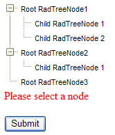

# Validation


You can use the built in ASP.NET validation with **RadTreeView**.

## Validating the TreeView with RequiredFieldValidator

To validate for selected node of a TreeView, just specify the ID of the tree in the **ControlToValidate** property of the **RequiredFieldValidator**. Validation checks to see if there is at least one selected node.

````ASPNET
<telerik:RadTreeView runat="server" ID="RadTreeView1">
    <Nodes>
        ...
	</Nodes>
</telerik:RadTreeView>
<asp:RequiredFieldValidator ID="RequiredFieldValidator1" ControlToValidate="RadTreeView1" runat="server" ErrorMessage="Please select a node">
</asp:RequiredFieldValidator>
````


If no node is selected, the validator detects an error and displays the error message:





## Validating the TreeView using the CompareValidator

You can validate the TreeView using **CompareValidator** control. You need to specify the ID of the tree in the **ControlToValidate** property, the **Operator** and **ValueToCompare** properties. The validation will be made against the **Value** property of the nodes if they have values and if not - against their **Text** property.

````ASPNET
<telerik:RadTreeView runat="server" ID="RadTreeView1" Skin="Hay">
    <Nodes>
        <telerik:RadTreeNode runat="server" Text="Australia" Value="RootItems">
            <Nodes>
                <telerik:RadTreeNode runat="server" Text="Sidney">
                </telerik:RadTreeNode>
                <telerik:RadTreeNode runat="server" Text="Brisbane">
                </telerik:RadTreeNode>
            </Nodes>
        </telerik:RadTreeNode>
        <telerik:RadTreeNode runat="server" Text="France" Value="RootItems">
            <Nodes>
                <telerik:RadTreeNode runat="server" Text="Paris">
                </telerik:RadTreeNode>
            </Nodes>
        </telerik:RadTreeNode>
        <telerik:RadTreeNode runat="server" Text="USA" Value="RootItems">
        </telerik:RadTreeNode>
    </Nodes>
</telerik:RadTreeView>
<asp:CompareValidator ID="CompareValidator1" runat="server" ControlToValidate="RadTreeView1" ErrorMessage="Please select a City" Operator="NotEqual" ValueToCompare="RootItems">
</asp:CompareValidator>
````


If a root nodes is selected, the validator detects an error and displays the error message:


## Causing Validation

The TreeView can trigger validation of other controls on the form when it performs a post-back to the server. Simply set the **CausesValidation** property to **True**.

By default, all validators on the Web page must be successful before the postback can occur. You can limit the controls that must be validated when the TreeView performs a post-back, while still allowing other controls on the Web page to be validated, by using validation groups. The validator controls have **ValidationGroup** property as does **RadTreeView**. Validation will be triggered only for the Validator controls where the **ValidationGroup** property matches the **RadTreeView** **ValidationGroup**. (If no **ValidationGroup** is set for the controls all Validators will be triggered.)

For a live example, see [Validation Groups](http://demos.telerik.com/aspnet-ajax/treeview/examples/functionality/validating/defaultcs.aspx)


# See Also

 * [Validating RadTreeView Online Example](http://demos.telerik.com/aspnet-ajax/treeview/examples/functionality/validating/defaultcs.aspx)

 * [Validate Treeview by Checked Nodes]()
