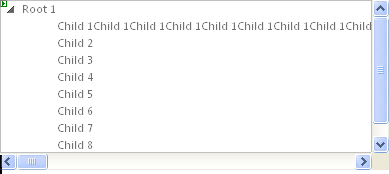

# Controlling Appearance


There are a number of ways you can customize the look & feel of your **RadTreeView** control.

## Dimensions

To change the basic dimensions of the **RadTreeView**:

* Use the **Height** property to control the height of the **TreeView**. If you do not set **Height**, the **TreeView** list sizes itself automatically based on the number of items in the list. If the value of **Height** is too small to display all of the items in the list, a vertical scroll bar appears.

* Set the **Width** property to specify the width of the input area of the control. 


## Look and Feel

* To change the overall look and feel of the **RadTreeView**, set the [Skin]() property.

* To change the way the Nodes expand and collapse, use [Animation]().

* To change the look of an individual item in **RadTreeView**, use the **CssClass** property and set up the CSS styles as needed.

* To provide a [right-to-left look and feel](), set the attribute of the page HTML or set the **dir** attribute within a *div* tag.

* To toggle the display of lines connecting Nodes, use the [ShowLineImages property]().

## Changing the font size

To adjust the font sizes of all items in **RadTreeView**, you should use the following CSS rule:

````CSS
.RadTreeView,
.RadTreeView a.rtIn,
.RadTreeView .rtEdit .rtIn input
{
   font-size:14px;
} 			
````


The declaration above increases the font size by 3px (since the default font size of **RadTreeView** is 11px).

## Changing the spacing between tree Nodes

To change the space between **RadTreeView** Nodes, you should use the following CSS rules:

````CSS
.RadTreeView .rtLI 
{
	padding-bottom: 10px;
}
.RadTreeView .rtUL .rtUL 
{
	margin-top: 10px;
}
.RadTreeView .rtLast 
{
	padding-bottom: 0; /* prevent double-spacing */
}     		
````


The declaration above adds a 10px space between the Nodes.

## Changing the Node lines

The Node lines of **RadTreeView** can be adjusted by modifying the following lines:

````CSS
.RadTreeView .rtLines .rtLI
{
   background:url('TreeView/NodeSpan.gif') repeat-y 0 0;
}
.RadTreeView .rtLines .rtFirst
{
   background:url('TreeView/FirstNodeSpan.gif') no-repeat 0 1.273em;
}
.RadTreeView .rtLines .rtLast,
.RadTreeView .rtLines .rtLast .rtUL
{
   background:none;
}
.RadTreeView .rtLines .rtTop
{
   background:url('TreeView/TopLine.gif') 0 0 no-repeat;
}
.RadTreeView .rtLines .rtLast .rtTop
{
   background:url('TreeView/SingleLine.gif') 0 0 no-repeat;
}
.RadTreeView .rtLines .rtMid
{
   background:url('TreeView/MiddleLine.gif') 0 0 no-repeat;
}
.RadTreeView .rtLines .rtBot
{
   background:url('TreeView/BottomLine.gif') 0 0 no-repeat;
} 		
````


The images, referenced by this CSS, have the following meaning:


| Image file name | Purpose of image |
| ------ | ------ |
|TopLineMiddleLineBottomLine|The images for first item, for items between the first and the last, and for the last item.Their role is to add the line before each tree Node.|
|SingleLine|This image has the same role as the images, described above. Used only when there is only one root item (therefore no sibling Nodes and should be rendered differently)|
|FirstNodeFirstNodeSpan|Images, containing only vertical lines. Please note the difference, that FirstNodeSpan contains a very high image that is needed for the proper rendering of RadTreeView.|

It is advised to copy the line images from an existing skin and modify them, which will reduce image modification problems to a minimum.


# See Also

 * [Improvemnts in Lightweight RenderMode R3 2016]()
