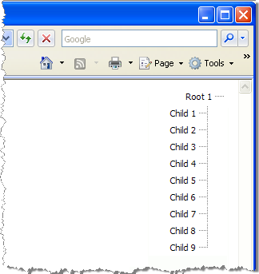

# Right-To-Left Support


**RadTreeView** supports right-to-left (RTL) language locales. Set the **dir** attribute of the page HTML or div tag to "rtl".




````ASPNET
<div dir="rtl">
    <telerik:RadTreeView ID="RadTreeView1" runat="server" Skin="Telerik">
        <Nodes>
            . . .
````


