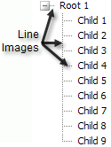
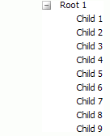

# ShowLineImages Property

## 

The existence of lines connecting Nodes is controlled by the __ShowLineImages__ property (default is __True__). Setting __ShowLineImages__ to __False__hides connecting images and shows only the +/- icons. You can also hide the line images by changing the RadTreeView [Skin](A2ACD8E0-A5F3-4093-A5DA-FF45D737F6FA).

__ShowLineImages__ = True

>caption 

__ShowLineImages__ = False

>caption 

