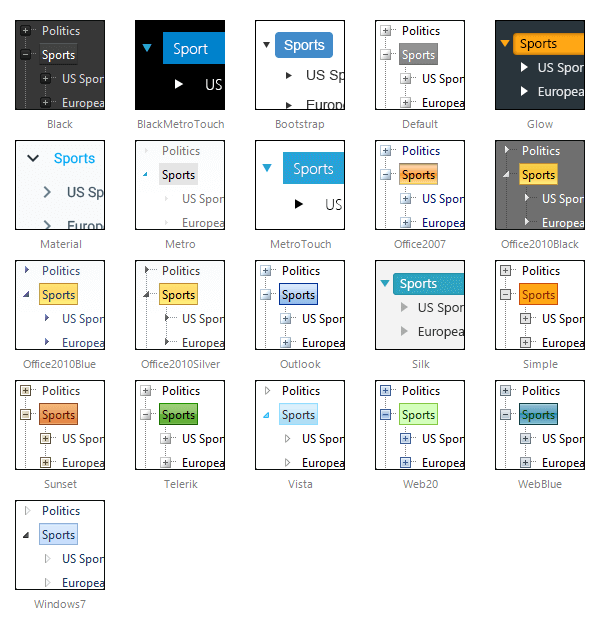

# Skins

To make customizing the appearance of **RadTreeView** as easy as possible, the control uses **skins**. A skin is a set of images and a CSS style sheet that can be applied to the **TreeView** elements (Nodes, images, etc.) and defines their look and feel. To apply a skin to the **TreeView**, set its **Skin** property, either using the properties pane or the **RadTreeView** [Smart Tag]().

**RadTreeView** comes with a number of built-in skins:

 

 @[template - Material skin is available only in Lightweight mode](/_templates/common/skins-notes.md#material-only-in-lightweight) 

# See Also

 * [Tutorial on Creating a Custom Skin]()

 * [Understanding the Skin CSS File]()

 * [CSS Skin File Selectors]()

 * [Telerik ThemeBuilder for ASP.NET AJAX](https://themebuilder.telerik.com/)

