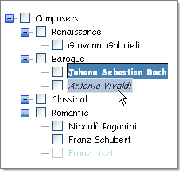
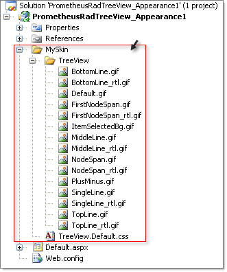
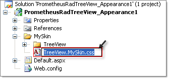
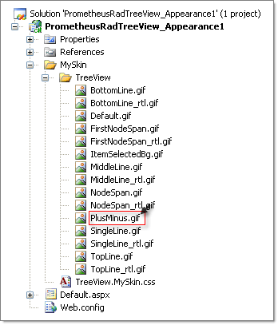
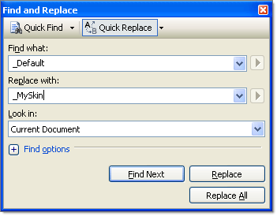
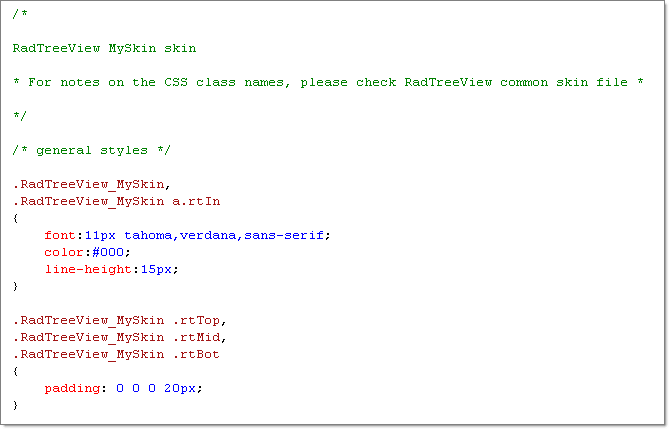
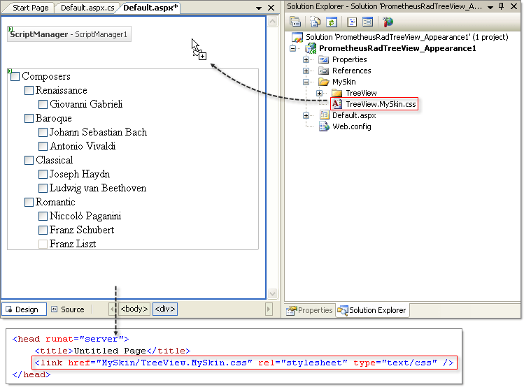

# Tutorial on Creating a Custom Skin


The following tutorial demonstrates creating a custom **RadTreeView** Skin, using the Default Skin as a template. This new Skin will use a new graphic for the plus/minus buttons, new background color and font settings for selected, hovered and disabled items. See [Understanding the Skin CSS File]() for more information on specific CSS file properties.



## Prepare the Project

1. In a new AJAX-Enabled application web form, add a **RadTreeView**. Set the **EnableEmbeddedSkins** property to **false**.

1. In the **Solution Explorer**, create a new "MySkin" directory in your project.

1. Copy the default **RadTreeView** Skin files from the installation directory to the "MySkin" directory; copy both the **\TreeView** directory that contains the images for this Skin and the **TreeView.Default.css** file that defines the Skin styles.
>note The file path will typically be similar to this example: *\Program Files\Progress\UI for ASP.NET AJAX RX YYYY\Skins\Default.* 
>


1. The solution should now look something like the screenshot below:


1. In **Solution Explorer**, rename **TreeView.Default.css** to **TreeView.MySkin.css**.


1. In MSPaint or other drawing tool of your choice, open the file **PlusMinus.gif** for editing. This image contains both the plus and minus graphics for the expand and collapse buttons. Change some of the coloring of the graphic and save the file.


## Populate the TreeView

In the ASP.NET markup, replace the existing definition for the **RadTreeView** with the one below.**


````ASPNET
<telerik:RadTreeView RenderMode="Lightweight" ID="RadTreeView1" runat="server" CheckBoxes="True" EnableEmbeddedSkins="False">
    <Nodes>
        <telerik:RadTreeNode runat="server" Text="Composers" Expanded="True" ExpandMode="ClientSide">
            <Nodes>
                <telerik:RadTreeNode runat="server" Text="Renaissance" ExpandMode="ClientSide" Expanded="True">
                    <Nodes>
                        <telerik:RadTreeNode runat="server" Text="Giovanni Gabrieli" />
                    </Nodes>
                </telerik:RadTreeNode>
                <telerik:RadTreeNode runat="server" Expanded="True" Text="Baroque">
                    <Nodes>
                        <telerik:RadTreeNode runat="server" Text="Johann Sebastian Bach" />
                        <telerik:RadTreeNode runat="server" Text="Antonio Vivaldi" />
                    </Nodes>
                </telerik:RadTreeNode>
                <telerik:RadTreeNode runat="server" Expanded="True" Text="Classical">
                    <Nodes>
                        <telerik:RadTreeNode runat="server" Text="Joseph Haydn" />
                        <telerik:RadTreeNode runat="server" Text="Ludwig van Beethoven" />
                    </Nodes>
                </telerik:RadTreeNode>
                <telerik:RadTreeNode runat="server" Expanded="True" Text="Romantic">
                    <Nodes>
                        <telerik:RadTreeNode runat="server" Text="Niccol&#242; Paganini" />
                        <telerik:RadTreeNode runat="server" Text="Franz Schubert" />
                        <telerik:RadTreeNode runat="server" Enabled="False" Text="Franz Liszt" />
                    </Nodes>
                </telerik:RadTreeNode>
            </Nodes>
        </telerik:RadTreeNode>
    </Nodes>
</telerik:RadTreeView>
````


## Edit the Skin CSS File

1. Open **TreeView.Default.css** for editing in Visual Studio.

1. Press **Ctrl+H** to invoke the **Find and Replace** dialog.

1. Set Find what: to **_Default**, Replace with: to **_MySkin**, and Look in: to **Current Document**.

1. Click the **Replace All** button.


1. The style sheet should now look something like the example below.


1. Locate the CSS selector **.RadTreeView_MySkin, .RadTreeView_MySkin a.rtIn** and change the font to **font:11px cursive;**.

1. Locate the CSS selector **.RadTreeView_MySkin .rtHover .rtIn** and change the background to **background: LightSteelBlue;**. Also add a new font style: **font-style:italic;**.

1. Locate the CSS selector **.RadTreeView_MySkin .rtSelected .rtIn**. Change the background to **background:SteelBlue;**. Also add a new font weight: **font-weight:bold;**.

1. Locate the CSS selector **.RadTreeView_MySkin .rtDisabled .rtIn**. Change the color to **color:LightBlue;**.

1. From the Solution Explorer drag the **TreeView.MySkin.css** to the design surface of the form. This step will automatically add a reference to the page **<head>** tag as a **<link>** as shown in the screenshot below.


1. Enter **MySkin** in the **RadTreeView** **Skin** property.

1. Press **F5** to run the application. *Notice the new plus/minus button graphics and new colors and font styles for hover, selected and disabled states.*


# See Also

 * [Improvemnts in Lightweight RenderMode R3 2016]()