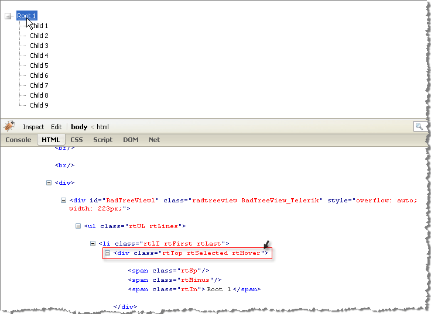

# Understanding the Skin CSS File


## 

Styles for RadControls are defined using Cascading Style Sheet (CSS) syntax. Each style consists of a selector that identifies an HTML element to be styled, and property/value pairs that describe each of the style specifics, e.g. color, padding, margins, etc. For example, the ".rtHover" style will underline the text.

````ASPNET
	    .RadTreeView_Telerik .rtHover .rtIn 
	    {
	        color:#363636;
	        text-decoration:underline;
	    } 
````


See the [CSS Skin File Selectors]() topic for more information on the specific CSS selectors used for RadTreeView skins. You can see custom styles applied in the screenshot below.

>tip The styled RadTreeView below is running in a[FireFox](http://www.mozilla.com/en-US/firefox/)browser in which the[Firebug](http://www.getfirebug.com)plug-in is used to help visualize the HTML on-the-fly. You can install and use the Firebug plug-in to audition changes to the CSS file and see the results instantly.
>


Each style maps to a "class" attribute in an HTML tag. For example, the ".RadTreeView_Telerik" is a general style that applies to the entire <div> tag that represents the control. Class attributes change as the property values for the control change. For example, the "Root" item is selected and has the mouse hovered in the TreeView. Notice the <li> list item tags and that the class attribute includes "rtTop rtSelected rtHover". So the styles that apply at this moment to the root node are the combined styles for the top node, selected nodes and hovered nodes.


>caption 


