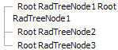

# Wrap TreeNode Text


## 

The text of the tree Nodes can be easily wrapped when needed. For example, if the value applied to the RadTreeView's **Width** property is smaller than the width of the Nodes.

You can apply **style="white-space:normal"** directly to the Node or the entire TreeView.

If you apply **style="white-space:normal"** to the whole TreeView, each Node's text will be wrapped when its width exceeds the width of the TreeView.

**Example:**

````ASPNET
	    <telerik:RadTreeView ID="RadTreeView1" runat="server" LoadingStatusPosition="BeforeNodeText"
	        Width="200px">
	        <Nodes>
	            <telerik:RadTreeNode runat="server" ExpandMode="ClientSide" Text="Root RadTreeNode1 Root RadTreeNode1"
	                Style="white-space: normal">
	            </telerik:RadTreeNode>
	            <telerik:RadTreeNode runat="server" ExpandMode="ClientSide" Text="Root RadTreeNode2">
	            </telerik:RadTreeNode>
	            <telerik:RadTreeNode runat="server" ExpandMode="ClientSide" Text="Root RadTreeNode3">
	            </telerik:RadTreeNode>
	        </Nodes>
	        <CollapseAnimation Duration="100" Type="OutQuint" />
	        <ExpandAnimation Duration="100" Type="OutQuart" />
	    </telerik:RadTreeView>
````


>caption 




