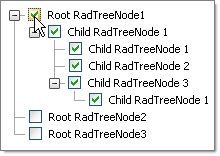

# Check-Uncheck All Child Nodes


## 

Set the [OnClientNodeChecked]() property of **RadTreeView** to the name of the client-side function that will handle the event. This function receives a reference to the checked Node. Using this Node reference you can determine if the Node is checked and get a reference to the child Nodes. Iterate the child Nodes and set the checked value of each. Also check if the child Node has its own children and recursively update the child Nodes as well. You can use this general pattern to set any child Node properties.

In the example below, the **OnClientNodeChecked** property of **RadTreeView** is set to **clientNodeChecked**. The **clientNodeChecked** function calls the **UpdateAllChildren()** function with a reference to the child Nodes collection and the checked status of the clicked Node.




````JavaScript	
<script type="text/javascript" language="javascript">

    function UpdateAllChildren(nodes, checked) {
        var i;
        var test;
        for (i = 0; i < nodes.get_count(); i++) {
            if (checked) {
                nodes.getNode(i).check();
            }
            else {
                nodes.getNode(i).set_checked(false);
            }

            if (nodes.getNode(i).get_nodes().get_count() > 0) {
                UpdateAllChildren(nodes.getNode(i).get_nodes(), checked);
            }
        }
    }
    function clientNodeChecked(sender, eventArgs) {
        var childNodes = eventArgs.get_node().get_nodes();
        var isChecked = eventArgs.get_node().get_checked();
        UpdateAllChildren(childNodes, isChecked);
    }

</script>
````
````ASPNET
<telerik:RadTreeView RenderMode="Lightweight" ID="RadTreeView1" runat="server" CheckBoxes="True" OnClientNodeChecked="clientNodeChecked">
</telerik:RadTreeView>
````

