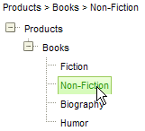

# Getting the Nodes Full Path


## 

To get the full path of a given node, walk the node hierarchy in reverse order using the client-side node object **get_parent()** method. Notice the statement within the while loop that checks if the currentObject.get_parent() is not null; this statement is only true when currentObject is a node. As the loop climbs back up the tree, eventually currentObject is the RadTreeView client side object and calling **get_parent()** will return null.

````JavaScript
	
	        var s = node.get_text();
	        var currentObject = node.get_parent();
	        while (currentObject != null) {
	            // get_parent() will return null when we reach the treeview
	            if (currentObject.get_parent() != null) {
	                s = currentObject.get_text() + " > " + s;
	            }
	            currentObject = currentObject.get_parent();
	        } 
				
````


The following example demonstrates retrieving the full node path. The main logic resides in the [OnClientMouseOver]() event. The arguments passed into the event provide a reference to the currently selected node. The node is traversed in reverse order and a string containing the text path is built up. Finally the text is assigned to the innerHTML of a div for display above the RadTreeView.


>caption 



````ASPNET
	
	    <script language="javascript" type="text/javascript">
	        function onMouseOver(sender, args) {
	            var node = args.get_node();
	            var s = node.get_text();
	            var currentObject = node.get_parent();
	            while (currentObject != null) {
	                // get_parent() will return null when we reach the treeview
	                if (currentObject.get_parent() != null) {
	                    s = currentObject.get_text() + " > " + s;
	                }
	                currentObject = currentObject.get_parent();
	            }
	            var tbPath;
	            tbPath = $get("pathText");
	            tbPath.innerHTML = s;
	        }
	        function onMouseOut(sender, args) {
	            $get("pathText").innerHTML = "";
	        }
	    </script>
	
	    <form id="form1" runat="server">
	    <asp:ScriptManager ID="ScriptManager1" runat="server" />
	    <div>
	        <div id="pathText" class="RadTreeView_Hay" style="height: 20px">
	        </div>
	        <telerik:RadTreeView ID="RadTreeView2" runat="server" OnClientMouseOver="onMouseOver"
	            OnClientMouseOut="onMouseOut" Skin="Hay">
	            <Nodes>
	                <telerik:RadTreeNode runat="server" Text="Products" ExpandMode="ClientSide">
	                    <Nodes>
	                        <telerik:RadTreeNode runat="server" Text="Books" ExpandMode="ClientSide">
	                            <Nodes>
	                                <telerik:RadTreeNode runat="server" Text="Fiction">
	                                </telerik:RadTreeNode>
	                                <telerik:RadTreeNode runat="server" Text="Non-Fiction">
	                                </telerik:RadTreeNode>
	                                <telerik:RadTreeNode runat="server" Text="Biography">
	                                </telerik:RadTreeNode>
	                                <telerik:RadTreeNode runat="server" Text="Humor">
	                                </telerik:RadTreeNode>
	                            </Nodes>
	                        </telerik:RadTreeNode>
	                    </Nodes>
	                </telerik:RadTreeNode>
	            </Nodes>
	        </telerik:RadTreeView>
	    </div>
	    </form>
````


# See Also

 * [RadTreeNode]()
