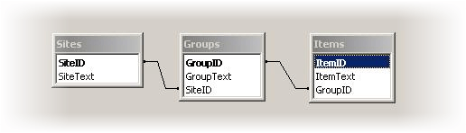

# Loading Related SQL Tables


## 

It is not always possible to load your treeview data from a single self-referencing table. Often you have a certain number of related SQL Tables and you need to populate your treeview instance based on the relationships in the Tables. While implementation details vary depending on your SQL setup, certain rules still apply. For the purpose of this topic, let us assume that we need to populate the treeview from 3 related SQL Tables

* Sites (SiteID - primary key)

* Groups (GroupID - primary key)

* Items (ItemID - primary key).

Sites may contain any number of Groups. Groups, in turn, my contain any number of Items, e.g.

__Site1__

__Group 1.1__

*Item 1.1.1*

*Item 1.1.2*

__Group 1.2__

*Item 1.2.1*

__Site__ 2

__Group 2.1__


Here is our DataBase relationship schema:


>caption 



The code creates three distinct DataTable instances for each Table in your database. The data is loaded into the tables, the tables are added to the DataSet and the relationships are established. After that loop, the dependencies are iterated to populate the nodes. Here is a sample version:


````C#
	
	
	    private void GenerateTreeView()
	    {
	        OleDbConnection dbCon = new OleDbConnection("Provider=Microsoft.Jet.OLEDB.4.0;Data Source=" + Server.MapPath("tables.mdb"));
	        dbCon.Open(); DataSet ds = new DataSet();
	        DataTable siteTable = new DataTable();
	        DataTable groupTable = new DataTable();
	        DataTable itemTable = new DataTable();
	        OleDbDataAdapter siteAdapter = new OleDbDataAdapter("SELECT * FROM Sites", dbCon);
	        OleDbDataAdapter groupAdapter = new OleDbDataAdapter("SELECT * FROM Groups", dbCon);
	        OleDbDataAdapter itemAdapter = new OleDbDataAdapter("SELECT * FROM Items", dbCon);
	        siteAdapter.Fill(siteTable);
	        groupAdapter.Fill(groupTable);
	        itemAdapter.Fill(itemTable);
	
	        ds.Tables.Add(siteTable);
	        ds.Tables.Add(groupTable);
	        ds.Tables.Add(itemTable);
	        ds.Relations.Add("SiteGroup", ds.Tables[0].Columns["SiteID"], ds.Tables[1].Columns["SiteID"]);
	        ds.Relations.Add("GroupItem", ds.Tables[1].Columns["GroupID"], ds.Tables[2].Columns["GroupID"]);
	        foreach (DataRow siteRow in ds.Tables[0].Rows)
	        {
	            RadTreeNode siteNode = new RadTreeNode(siteRow["SiteText"].ToString());
	            RadTree1.Nodes.Add(siteNode);
	            foreach (DataRow groupRow in siteRow.GetChildRows("SiteGroup"))
	            {
	                RadTreeNode groupNode = new RadTreeNode(groupRow["GroupText"].ToString());
	                siteNode.Nodes.Add(groupNode);
	                foreach (DataRow itemRow in groupRow.GetChildRows("GroupItem"))
	                {
	                    RadTreeNode itemNode = new RadTreeNode(itemRow["ItemText"].ToString());
	                    groupNode.Nodes.Add(itemNode);
	                }
	            }
	        }
	    } 
	
````
````VB.NET
	
	    Private Sub GenerateTreeView()
	        Dim dbCon As New OleDbConnection("Provider=Microsoft.Jet.OLEDB.4.0;Data Source=" + Server.MapPath("tables.mdb"))
	        dbCon.Open()
	        Dim ds As New DataSet()
	        Dim siteTable As New DataTable()
	        Dim groupTable As New DataTable()
	        Dim itemTable As New DataTable()
	        Dim siteAdapter As New OleDbDataAdapter("SELECT * FROM Sites", dbCon)
	        Dim groupAdapter As New OleDbDataAdapter("SELECT * FROM Groups", dbCon)
	        Dim itemAdapter As New OleDbDataAdapter("SELECT * FROM Items", dbCon)
	        siteAdapter.Fill(siteTable)
	        groupAdapter.Fill(groupTable)
	        itemAdapter.Fill(itemTable)
	
	        ds.Tables.Add(siteTable)
	        ds.Tables.Add(groupTable)
	        ds.Tables.Add(itemTable)
	        ds.Relations.Add("SiteGroup", ds.Tables(0).Columns("SiteID"), ds.Tables(1).Columns("SiteID"))
	        ds.Relations.Add("GroupItem", ds.Tables(1).Columns("GroupID"), ds.Tables(2).Columns("GroupID"))
	        For Each siteRow As DataRow In ds.Tables(0).Rows
	            Dim siteNode As New RadTreeNode(siteRow("SiteText").ToString())
	            RadTree1.Nodes.Add(siteNode)
	            For Each groupRow As DataRow In siteRow.GetChildRows("SiteGroup")
	                Dim groupNode As New RadTreeNode(groupRow("GroupText").ToString())
	                siteNode.Nodes.Add(groupNode)
	                For Each itemRow As DataRow In groupRow.GetChildRows("GroupItem")
	                    Dim itemNode As New RadTreeNode(itemRow("ItemText").ToString())
	                    groupNode.Nodes.Add(itemNode)
	                Next
	            Next
	        Next
	    End Sub
	
	
````

