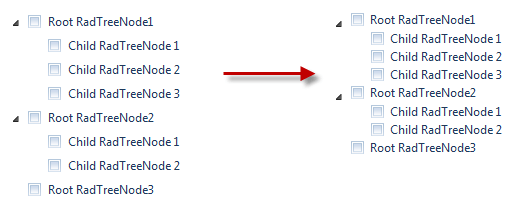

# Reduce the Space Between the Nodes


## 


To reduce the space between the nodes, you should use the following CSS rules:


````CSS
div.RadTreeView {
  line-height: 16px;
}

div.RadTreeView .rtSp {
  height: 14px;
}

div.RadTreeView .rtHover .rtIn,
div.RadTreeView .rtSelected .rtIn {
  padding: 0px 1px 0px;
}

div.RadTreeView .rtIn {
  padding: 1px 2px 1px;
} 			
````


Here is the final result:


>caption 




