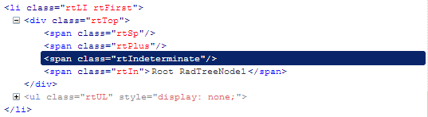

# Tri-Sate client-side specifics

## Check State

The RadTreeNode client-side object exposes the **get_checkState**function which returns **TreeNodeCheckState** which represents the current state of the Node's CheckBox.

**TreeNodeCheckState** can be:

* **0 - Unchecked**

* **1 - Checked**

* **2 - Indeterminate**

## Rendering

Tri-State CheckBoxes are actually rendered as  elements with predefined CSS classes. Images, defined in these CSS classes as backgrounds to the  elements represent the three states.

>caption 

There are three CSS classes for each of the three states of the CheckBoxes: **rtChecked**, **rtUnchecked** and **rtIndeterminate**.

To get the  element of a Node at the client use the **get_checkBoxElement()** function as you would normally do to get the real CheckBox element in non-Tri-State CheckBoxes mode.

## Events

If a Node's CheckBox is clicked the client-side **OnClientNodeClicking** and **OnClientNodeClicked** events fire only for the clicked Node regardless of the **CheckChildNodes** property of RadTreeView.
