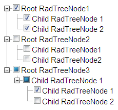

# Tri-State CheckBoxes Overview

## 

>caption 

The Tri-State CheckBox mode of RadTreeView allows for Nodes' CheckBoxes (when enabled) to have an additional, third state - **Indeterminate**. A Node's CheckBox is in **Indeterminate**state if it has both **Checked** and **Unchecked**CheckBoxes of child Nodes.

When RadTreeView is in Tri-State CheckBox mode, a Node's CheckBox can be in either of the following states:

* **Checked -**CheckBoxes of all child Nodes are **Checked**.

* **Unchecked** - CheckBoxes of all child Nodes are **Unchecked**.

* **Indeterminate** - there are **Checked**and **Unchecked**child Nodes' CheckBoxes.

A CheckBox in Tri-State-enabled TreeView goes through its states in the following order:

* **Checked** -> **Unchecked**

* **Unchecked** -> **Checked**

* **Indeterminate** -> **Checked**

The Tri-State CheckBox mode of RadTreeView is enabled by setting the **TriStateCheckBoxes** property of the control to **True**. A prerequisite for this mode to work is to have enabled also **CheckBoxes** for Nodes.

An addition to the Tri-State CheckBox mode of RadTreeView is the "Check Child Nodes" functionality. When the **CheckChildNodes** property of RadTreeView is set to **True**and if:

* A parent Node's CheckBox is checked then all child Nodes' CheckBoxes are also checked.

* A parent Node's CheckBox is unchecked then all child Node's CheckBoxes are also unchecked.

The **Indeterminate** state of a Node is not persisted. That is if a Node's CheckBox is in **Indeterminate**state and is unchecked, it can no longer return in the same **Indeterminate** state.

>caution Tri-State CheckBoxes are actually rendered as  elements with predefined CSS styles. They are not styled by the[RadFormDectorator](4F3D6E83-A8FB-4DE9-9DDD-D007366B31B9)control. For more information, please read the[Tri-Sate client-side specifics]()topic.
>

