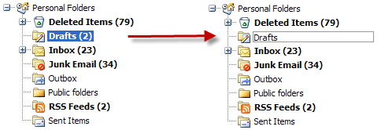

# OnClientNodeEditStart


## 

The **OnClientNodeEditStart** client-side event is called as the edit begins. This event can not be canceled.

You can use this event to set any properties of the **input** area of the edited node.

The event handler receives parameters:

1. The **TreeView** instance that fired the event.

1. Event arguments with functions:

1. **get_node()** retrieves a reference to the node being edited.

* You can call **get_text()** from this node reference to get the "old" text prior to editing.

* You can call **get_inputElement()** from this node reference to get the INPUT area of the edited node

1. **get_domEvent()** retrieves a DOM event object of the node edit.


The example below uses the **OnClientNodeEditStart** event to change the text displayed in the INPUT area.

We will achieve the following: when you edit a node like **Drafts (2)** you will not see the (2) in the INPUT area, but only the real text like below. We will use the [OnClientNodeEdited]() event to restore the number (2) to the original text upon saving.


>caption 




````ASPNET
<telerik:RadTreeView RenderMode="Lightweight" ID="RadTreeView1" 
    OnClientNodeEditStart="OnClientNodeEditStartHandler"
    OnClientNodeEdited="OnClientNodeEditedHandler" 
    Skin="Office2007" 
    AllowNodeEditing="true"
    runat="server">
...
</telerik:RadTreeView>
````
````JavaScript
//will hold the (n) text of the node being edited
var nodeCountInfo = "";

function OnClientNodeEditStartHandler(sender, eventArgs) {
    //get the node
    var node = eventArgs.get_node();
    //get a reference to the INPUT area of the edited node
    var textInput = node.get_inputElement();
    //set the width property of the INPUT
    textInput.width = "150";

    //match the (n) string
    var regExpCount = /\(\d+\)/;
    var matches = regExpCount.exec(node.get_text());
    if (matches) {
        //save the matched text for later use in the OnClientNodeEdited event
        nodeCountInfo = matches[0];
        //remove the count number from the text of the edited node
        textInput.value = node.get_text().replace(nodeCountInfo, "");
    }
}

function OnClientNodeEditedHandler(sender, eventArgs) {
    var node = eventArgs.get_node();

    sender.trackChanges();
    //use the nodeCountInfo to restore the (n) string
    node.set_text(node.get_text() + nodeCountInfo);
    sender.commitChanges();
    nodeCountInfo = "";
}	
````


>tip This event is available in all versions after **Q3 SP2 2008** release.
>


# See Also

 * [OnClientNodeEditing]()

 * [OnClientNodeEdited]()
