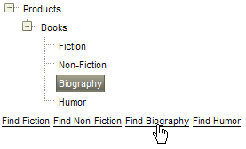

# Client-side Programming Overview


RadTreeView provides a flexible client-side API that allows you to interact with the TreeView, Nodes collection and individual Nodes, all on the client.

## Getting the RadTreeView client-side object

RadTreeView creates a client-side object with the ClientID of the TreeView. You can obtain the reference by using the $find() function and passing in the ClientID of the TreeView.

````JavaScript
	        var tree = $find("RadTreeView1");
	        // or...
	        var tree = $find("<%= RadTreeView1.ClientID %>");
````


## Getting a RadTreeNode client-side object

Once you get the client-side object of RadTreeView, you can use one of the  [client RadTreeView object functions]() **findNodeByText()**,**findNodeByValue()** or **findNodeByAttribute()**to get the instance of a particular Node.

````JavaScript
	        function FindNode() {
	            var tree = $find("<%= RadTreeView1.ClientID %>");
	            var node = tree.findNodeByText("Child RadTreeNode 1");
	            //... or ...
	            var node1 = tree.findNodeByValue("3");
	            //... or ...
	            var node2 = tree.findNodeByAttribute("MyCustomAttribute", "Some Value");
	            node.get_parent().expand();
	            node.select();
	        }
````


## Using RadTreeNode Object client-side functions

Once you have a client-side reference to a Node, you can call functions to

* enable/disable

* select/deselect

* highlight/unhighlight

* check/uncheck/toggle

* expand/collapse

* showLoadingStatus/hideLoadingStatus

* startEdit/endEdit

See [the RadTreeNode Object]() topic for more specifics on calling these functions.

For example, the **selectNode** function below demonstrates getting a client-side reference to a RadTreeView, finding a specific Node and selecting it.


>caption 



````JavaScript
	        function selectNode(text) {
	            var treeView = $find("<%= RadTreeView2.ClientID %>");
	            var node = treeView.findNodeByText(text);
	            node.select();
	        }
````


The full project shows several links that call **selectNode()** with text of specific Nodes to find. When the user clicks on the link the corresponding Node is found and highlighted.

````ASPNET
	
	    </script>
	
	    <script language="javascript" type="text/javascript">
	        function selectNode(text) {
	            var treeView = $find("<%= RadTreeView2.ClientID %>");
	            var node = treeView.findNodeByText(text);
	            node.select();
	        }
	    </script>
	
	    <form id="form1" runat="server">
	    <asp:ScriptManager ID="ScriptManager1" runat="server" />
	    <div>
	        <telerik:RadTreeView ID="RadTreeView2" runat="server" Skin="Hay">
	            <Nodes>
	                <telerik:RadTreeNode runat="server" Text="Products" ExpandMode="ClientSide">
	                    <Nodes>
	                        <telerik:RadTreeNode runat="server" Text="Books" ExpandMode="ClientSide">
	                            <Nodes>
	                                <telerik:RadTreeNode runat="server" Text="Fiction">
	                                </telerik:RadTreeNode>
	                                <telerik:RadTreeNode runat="server" Text="Non-Fiction">
	                                </telerik:RadTreeNode>
	                                <telerik:RadTreeNode runat="server" Text="Biography">
	                                </telerik:RadTreeNode>
	                                <telerik:RadTreeNode runat="server" Text="Humor">
	                                </telerik:RadTreeNode>
	                            </Nodes>
	                        </telerik:RadTreeNode>
	                    </Nodes>
	                </telerik:RadTreeNode>
	            </Nodes>
	        </telerik:RadTreeView>
	        <a href="javascript: selectNode('Fiction');" class="RadTreeView_Hay">Find Fiction</a>
	        <a href="javascript: selectNode('Non-Fiction');" class="RadTreeView_Hay">Find Non-Fiction</a>
	        <a href="javascript: selectNode('Biography');" class="RadTreeView_Hay">Find Biography</a>
	        <a href="javascript: selectNode('Humor');" class="RadTreeView_Hay">Find Humor</a>
	    </div>
	    </form>
````


## Using the RadTreeNodeCollection client-side Object

To operate on all Nodes of a collection of Nodes use the [RadTreeNodeCollection object](). You can get a reference to this collection through the **get_nodes()** function of [RadTreeNode]() object or use the following functions of the client [RadTreeView]() object:

* **get_selectedNodes**

* **get_nodes**

* **get_allNodes**

````JavaScript
	        function GetNodes() {
	            var tree = $find("<%= RadTreeView1.ClientID %>");
	            for (var i = 0; i < tree.get_nodes().get_count(); i++) {
	                var node = tree.get_nodes().getNode(i);
	                alert(node.get_text());
	            }
	        }
````


Once you have a reference to a [RadTreeNodeCollection object]() you can call its functions to add, insert, and remove Nodes, as well as getting the index of a particular Node or the count of all Nodes in the collection.

````JavaScript
	
	        function AddNode() {
	            var tree = $find("<%= RadTreeView1.ClientID %>");
	            tree.trackChanges();
	            var node = new Telerik.Web.UI.RadTreeNode();
	            node.set_text("New Node");
	            tree.get_nodes().add(node);
	            tree.commitChanges();
	        }
	
````


# See Also

 * [RadTreeView]()

 * [RadTreeNode]()

 * [RadTreeNodeCollection]()
