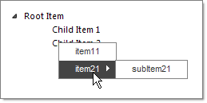

# Creating Context Menus at Runtime


## 

The example below shows how to dynamically create Context Menus and apply them to Nodes. The code below creates two Context Menus and applies them to the first and second level Nodes accordingly.




````ASPNET
	    <telerik:RadTreeView ID="RadTreeView1" runat="server" Skin="Vista">
	        <Nodes>
	            <telerik:RadTreeNode runat="server" Text="Root Item" ContextMenuID="HelpDeskMenu">
	                <Nodes>
	                    <telerik:RadTreeNode runat="server" Text="Child Item 1">
	                    </telerik:RadTreeNode>
	                    <telerik:RadTreeNode runat="server" Text="Child Item 2">
	                    </telerik:RadTreeNode>
	                </Nodes>
	            </telerik:RadTreeNode>
	        </Nodes>
	    </telerik:RadTreeView>
````


````C#
	using System;
	using Telerik.Web.UI;
	namespace RadTreeView_ContextMenu
	{
	   public partial class _Default : System.Web.UI.Page
	   {
	       protected void Page_Load(object sender, EventArgs e)
	       {
	           if (!IsPostBack)
	           {
	               RadTreeViewContextMenu contextMenu1 = new RadTreeViewContextMenu();
	               contextMenu1.ID = "contextMenu1";
	               RadMenuItem menuItem1 = new RadMenuItem();
	               menuItem1.Text = "item1";
	               contextMenu1.Items.Add(menuItem1);
	               RadMenuItem menuItem2 = new RadMenuItem();
	               menuItem2.Text = "item2";
	               contextMenu1.Items.Add(menuItem2);
	               RadTreeView1.ContextMenus.Add(contextMenu1);
	               RadTreeViewContextMenu contextMenu2 = new RadTreeViewContextMenu();
	               contextMenu2.ID = "contextMenu2";
	               RadMenuItem menuItem11 = new RadMenuItem();
	               menuItem11.Text = "item11";
	               contextMenu2.Items.Add(menuItem11);
	               RadMenuItem menuItem21 = new RadMenuItem();
	               menuItem21.Text = "item21";
	               //You can also add sub-items to the ContextMenuItems
	               RadMenuItem subItem21 = new RadMenuItem();
	               subItem21.Text = "subItem21";
	               menuItem21.Items.Add(subItem21);
	               contextMenu2.Items.Add(menuItem21);
	               RadTreeView1.ContextMenus.Add(contextMenu2);
	               foreach (RadTreeNode node in RadTreeView1.GetAllNodes())
	               {
	                   node.ContextMenuID = node.Level == 0 ? "contextMenu1" : "contextMenu2";
	               }
	           }
	       }
	   }
	}      
	
			
````
````VB.NET
	
	Imports System
	Imports Telerik.Web.UI
	namespace RadTreeView_ContextMenu
	        Partial Public Class _Default
	            Inherits System.Web.UI.Page
	            Protected Sub Page_Load(ByVal sender As Object, ByVal e As EventArgs)
	                If Not IsPostBack Then
	                    Dim contextMenu1 As New RadTreeViewContextMenu()
	                    contextMenu1.ID = "contextMenu1"
	                    Dim menuItem1 As New RadMenuItem()
	                    menuItem1.Text = "item1"
	                    contextMenu1.Items.Add(menuItem1)
	                    Dim menuItem2 As New RadMenuItem()
	                    menuItem2.Text = "item2"
	                    contextMenu1.Items.Add(menuItem2)
	                    RadTreeView1.ContextMenus.Add(contextMenu1)
	                    Dim contextMenu2 As New RadTreeViewContextMenu()
	                    contextMenu2.ID = "contextMenu2"
	                    Dim menuItem11 As New RadMenuItem()
	                    menuItem11.Text = "item11"
	                    contextMenu2.Items.Add(menuItem11)
	                    Dim menuItem21 As New RadMenuItem()
	                    menuItem21.Text = "item21"
	                    'You can also add sub-items to the ContextMenuItems
	                    Dim subItem21 As New RadMenuItem()
	                    subItem21.Text = "subItem21"
	                    menuItem21.Items.Add(subItem21)
	                    contextMenu2.Items.Add(menuItem21)
	                    RadTreeView1.ContextMenus.Add(contextMenu2)
	                    For Each node As RadTreeNode In RadTreeView1.GetAllNodes()
	                        node.ContextMenuID = IIf(node.Level = 0, "contextMenu1", "contextMenu2")
	                    Next
	                End If
	            End Sub
	        End Class
	    End Namespace
````

