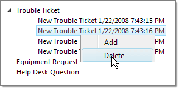

# Context Menus Overview


## 

**RadTreeView** supports its own built-in Context Menus. The Context Menu can be defined declaratively (in the aspx page), in the **ContextMenus** collection editor in the designer or in the code-behind. You can assign to each Node its own Context Menu using the **ContextMenuID** property of RadTreeNode. If no **ContextMenuID** is specified, the first instance from the **ContextMenu** collection will be assigned to the Node. Context Menus can be multi-leveled. To disable the context menu for a given Node, set the **EnableContextMenu** property to **False**.

The example below defines both the **RadTreeView** structure and a Context Menu, inline. To the first root Node, "Trouble Ticket" is assigned the "HelpDeskMenu" Context Menu, while the other two root Nodes have the **EnableContextMenu** property set to **False**. The Context Menu has two items in a single level - "Add" and "Delete". Also note that the **OnContextMenuItemClick** event is handled. In the **OnContextMenuItemClick** event handler, the **RadTreeViewContextMenuEventArgs** parameter makes both the Menu Item and the tree Node available. In the example code the event handler checks to see what is the value of the Menu Item and executes code respectively for "Add" or "Delete". The Node **Level** property is also checked to verify that the operation is correct in the current context, i.e. deletions should be allowed for trouble tickets, but not for the root Node "Trouble Ticket". The "Add" code adds a Node to the "Trouble Ticket" Nodes collection and expands the Node. The "Delete" code simply calls the selected Node's Remove() method.



````ASPNET
<telerik:RadTreeView RenderMode="Lightweight" ID="RadTreeView1" runat="server" Skin="Vista" OnContextMenuItemClick="RadTreeView1_ContextMenuItemClick">
    <ContextMenus>
        <telerik:RadTreeViewContextMenu runat="server" ID="HelpDeskMenu" ClickToOpen="True"
            Skin="Vista">
            <Items>
                <telerik:RadMenuItem Text="Add" Value="Add">
                </telerik:RadMenuItem>
                <telerik:RadMenuItem Text="Delete" Value="Delete">
                </telerik:RadMenuItem>
            </Items>
        </telerik:RadTreeViewContextMenu>
    </ContextMenus>
    <Nodes>
        <telerik:RadTreeNode runat="server" Text="Trouble Ticket" ContextMenuID="HelpDeskMenu">
        </telerik:RadTreeNode>
        <telerik:RadTreeNode runat="server" Text="Equipment Request" EnableContextMenu="false">
        </telerik:RadTreeNode>
        <telerik:RadTreeNode runat="server" Text="Help Desk Question" EnableContextMenu="false">
        </telerik:RadTreeNode>
    </Nodes>
</telerik:RadTreeView>
````
````C#
protected void RadTreeView1_ContextMenuItemClick(object sender, Telerik.Web.UI.RadTreeViewContextMenuEventArgs e)
{
    switch (e.MenuItem.Value)
    {
        case "Add":
            if (e.Node.Level == 0)
            {
                e.Node.Nodes.Add(new RadTreeNode("New " + e.Node.Text + " " + DateTime.Now.ToString()));
                e.Node.Expanded = true;
            }
            break;
        case "Delete":
            if (e.Node.Level == 1)
            {
                e.Node.Remove();
            }
            break;
    }
}
````
````VB.NET
Protected Sub RadTreeView1_ContextMenuItemClick(ByVal sender As Object, ByVal e As Telerik.Web.UI.RadTreeViewContextMenuEventArgs)
    Select Case e.MenuItem.Value
        Case "Add"
            If e.Node.Level = 0 Then
                e.Node.Nodes.Add(New RadTreeNode("New " + e.Node.Text + " " + DateTime.Now.ToString()))
                e.Node.Expanded = True
            End If
            Exit Select
        Case "Delete"
            If e.Node.Level = 1 Then
                e.Node.Remove()
            End If
            Exit Select
    End Select
End Sub
````

