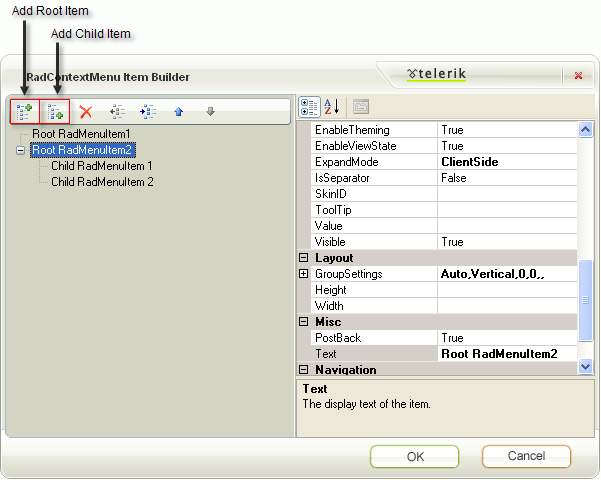

# Tutorial on Creating a Context Menu at Design Time


## 

The following tutorial demonstrates how to build and attach Context Menus to RadTreeNodes. The tutorial also shows how to respond to Context Menu clicks both from the server and client sides.


1. Add a RadTreeView control to a new web page.

1. In the Properties Window, click the __ContextMenus__ property ellipses button. *This step will display the RadTreeViewContextMenu Collection Editor dialog.*

1. Click the __Add__ button to add a new __RadTreeViewContextMenu__ item.

1. In the properties window on the right side of the dialog, set the __ID__ property to "MyContextMenu". Locate the __Items__ property and click the ellipses button. *This step will display the RadContextMenu Item Builder dialog.*

1. In the __RadContextMenuItem Builder__ dialog click the __Add Root Item__ button twice, select the second item and click the __Add Child Item__ button twice.

1. Select the first item and set the __Text__ property of the two root Items to "Edit" and "Add". Set the __Text__ property of "Add" child Items to "Before" and "After". The __RadContextMenu Item Builder__ dialog should look something like the screenshot below.

1. Click __OK__ to close the __RadContextMenu Item Builder__ dialog.

1. Click __OK__ to close the __RadTreeViewContextMenu Collection Editor__ dialog.

1. Open the RadTreeView Smart Tag and click the __Build RadTreeView__ link. *This step will open the RadTreeView Item Builder.*

1. Click the __Add Root Node__ button three times to create three __RadTreeNode__ objects. Set the __ContextMenuID__ property for all three items to "MyContextMenu".

1. Click the events button the Properties Window for the RadTreeView. Locate the __ContextMenuItemClick__ event and double-click. *This step will create a ContextMenuItemClick event handler and display the code view for it.*

1. In the __ContextMenuItemClick__ event handler add the code below. **

>note  *The code here handles the "Add Before" and "Add After" menu items. The "Edit" item will be handled on the client side in the following steps. Also notice the reference to __Telerik.Web.UI__ used to support the __RadTreeNode__ type.* 
>


1. 

>tabbedCode

````C#
	     
	using System;using Telerik.Web.UI;
	namespace RadTreeView_ContextMenu
	{    
	    public partial class _Default : System.Web.UI.Page    
	    {        
	        protected void RadTreeView1_ContextMenuItemClick(object sender, Telerik.Web.UI.RadTreeViewContextMenuEventArgs e)        
	        {            
	            if (e.MenuItem.Text == "Before")            
	            {               
	                e.Node.InsertBefore(new RadTreeNode("New Node Before")); 
	           
	            }            
	            else if (e.MenuItem.Text == "After")            
	            {                
	                e.Node.InsertAfter(new RadTreeNode("New Node After"));           
	            }        
	        }    
	    }
	}
				
````


````VB.NET
	
	Imports System
	Imports Telerik.Web.UI
	namespace RadTreeView_ContextMenu
	        Partial Public Class _Default
	            Inherits System.Web.UI.Page
	            Protected Sub RadTreeView1_ContextMenuItemClick(ByVal sender As Object, ByVal e As Telerik.Web.UI.RadTreeViewContextMenuEventArgs)
	                If e.MenuItem.Text = "Before" Then
	                    e.Node.InsertBefore(New RadTreeNode("New Node Before"))
	                ElseIf e.MenuItem.Text = "After" Then
	                    e.Node.InsertAfter(New RadTreeNode("New Node After"))
	                End If
	            End Sub
	        End Class
	    End Namespace
	
````


>end

1. In the Properties Window set the RadTreeView __OnClientContextMenuItemClicking__ property to "clientContextMenuItemClicking".

1. In the ASP.NET markup for the page add the script code below.

1. 

>note This code gets references to the Context Menu Item that was clicked and the Node for that Context Menu Item. If the Menu Item text is "Edit" then the Node is put into editing state. __set_cancel()__ is called to prevent the Postback. If you don't prevent the postback the refresh will end the Node editing, subsequently producing the following visual effect: Node opens for editing momentarily, then closes. Finally, the Menu is closed calling its hide() function.
>


````ASPNET
	
	    <script type="text/javascript" language="javascript">
	        function clientContextMenuItemClicking(sender, eventArgs) {
	            var node = eventArgs.get_node();
	            var item = eventArgs.get_menuItem();
	            if (item.get_text() == "Edit") {
	                node.startEdit();
	                // cancel the server event
	                eventArgs.set_cancel(true);
	                // close the menu
	                item.get_menu().hide();
	            }
	        }
	    </script>
	
	    ...
	    <telerik:RadTreeView ID="RadTreeView1" 
	                         runat="server" 
	                         OnClientContextMenuItemClicking="clientContextMenuItemClicking"
	                         Skin="Default">
````


1. Press F5 to run the application. Click the "Add Before" and "Add After" Menu Items. Also notice that clicking the "Edit" Menu Item puts the Node into edit mode and that no postback occurs.
