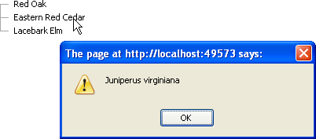

# Using Custom Attributes at the Client


## 

Access custom attributes on the client side by using first the __get_attributes()__ method. Then extract the specific attribute with the __getAttribute()__ method, passing the attribute name.

>caution The custom attribute's name should not be an __HTML reserved word__ . Please see[this article]()for more information.
>


The example below demonstrates accessing the node attributes within the OnClientNodeClicked event handler.


>caption 



````ASPNET
	
	    <script language="javascript" type="text/javascript">   
	        function onNodeClicked(sender, args)  
	        {    
	            var node = args.get_node();    
	            alert(node.get_attributes().getAttribute("ScientificName"));
	            //you can also set attributes, like:
	            //node.get_attributes().setAttribute("ScientificName");
	        }
	    </script>
	
	    <telerik:RadTreeView ID="RadTreeView1" runat="server" OnClientNodeClicked="onNodeClicked">
	        <Nodes>
	            <telerik:RadTreeNode runat="server" Text="Red Oak" ScientificName="Quercus rubra">
	            </telerik:RadTreeNode>
	            <telerik:RadTreeNode runat="server" Text="Eastern Red Cedar" ScientificName="Juniperus virginiana">
	            </telerik:RadTreeNode>
	            <telerik:RadTreeNode runat="server" Text="Lacebark Elm" ScientificName="Ulmus parvifolia ">
	            </telerik:RadTreeNode>
	        </Nodes>
	    </telerik:RadTreeView>
````


# See Also

 * [RadTreeNode]()

 * [Custom Attributes]()
