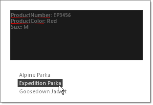

# Using Custom Attributes at the Server


## 

Access attributes through the RadTreeNode __Attributes__ collection by specifying a key name:

>tabbedCode

````C#
	     
		node.Attributes["MyCustomAttributeKey"] = "Some value";
				
````
````VB.NET
	     
		node.Attributes("MyCustomAttributeKey") = "Some value"
				
````
>end

The example below iterates the __Attributes__ collection of a selected node and displays the key names and values in a RadTextBox.



````ASPNET
	    <telerik:RadTreeView ID="RadTreeView1" runat="server" OnNodeClick="RadTreeView1_NodeClick"
	        Skin="Black">
	        <Nodes>
	            <telerik:RadTreeNode runat="server" Text="Alpine Parka" ProductNumber="AP0234" ProductColor="Blue"
	                ProductSize="XL">
	            </telerik:RadTreeNode>
	            <telerik:RadTreeNode runat="server" Text="Expedition Parka" ProductNumber="EP3456"
	                ProductColor="Red" Size="M">
	            </telerik:RadTreeNode>
	            <telerik:RadTreeNode runat="server" Text="Goosedown Jacket" ProductNumber="GJ6549"
	                ProductColor="Yellow" Size="L">
	            </telerik:RadTreeNode>
	        </Nodes>
	    </telerik:RadTreeView>
````


>tabbedCode

````C#
	     
		protected void RadTreeView1_NodeClick(object sender, Telerik.Web.UI.RadTreeNodeEventArgs e)
	    {    
	        foreach (string key in e.Node.Attributes.Keys)    
	        {        
	            tbNode.Text += key + ": " + e.Node.Attributes[key] + System.Environment.NewLine;    
	        }
	    }
				
````
````VB.NET
	     
	    Protected Sub RadTreeView1_NodeClick(ByVal sender As Object, ByVal e As Telerik.Web.UI.RadTreeNodeEventArgs)
	        For Each key As String In e.Node.Attributes.Keys
	            tbNode.Text += key + ": " + e.Node.Attributes(key) + System.Environment.NewLine
	        Next
	    End Sub
	
````
>end
