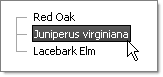

# Using Custom Attributes Declaratively


## 

Custom attributes can be added to a node by simply adding an HTML attribute to a RadTreeNode tag. Then access the attribute in [server-side]() or [client-side]() code. The example below defines a custom "ScientificName" attribute. The attribute is accessed in the server-side NodeClick event through the **Attributes** property.


>caption 



````ASPNET
	    <telerik:RadTreeView ID="RadTreeView1" runat="server" OnNodeClick="RadTreeView1_NodeClick">
	        <Nodes>
	            <telerik:RadTreeNode runat="server" ExpandMode="ClientSide" Text="Red Oak" ScientificName="Quercus rubra">
	            </telerik:RadTreeNode>
	            <telerik:RadTreeNode runat="server" ExpandMode="ClientSide" Text="Eastern Red Cedar"
	                ScientificName="Juniperus virginiana">
	            </telerik:RadTreeNode>
	            <telerik:RadTreeNode runat="server" ExpandMode="ClientSide" Text="Lacebark Elm" ScientificName="Ulmus parvifolia ">
	            </telerik:RadTreeNode>
	        </Nodes>
	    </telerik:RadTreeView>
````


````C#
	     
		protected void RadTreeView1_NodeClick(object sender, Telerik.Web.UI.RadTreeNodeEventArgs e)
	    {    
	        e.Node.Text = e.Node.Attributes["ScientificName"];
	    }
				
````
````VB.NET
	
	    Protected Sub RadTreeView1_NodeClick(ByVal sender As Object, ByVal e As Telerik.Web.UI.RadTreeNodeEventArgs)
	        e.Node.Text = e.Node.Attributes("ScientificName")
	    End Sub
	
````


>caution The custom attribute's name should not be an **HTML reserved word** . Please see[this article]()for more information.
>


# See Also

 * [Custom Attributes]()
