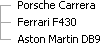
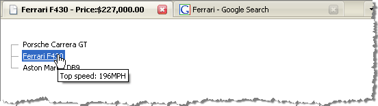

# Binding to Array and ArrayList


## 

Binding RadTreeView to a data source that implements __IEnumerable__, such as Array or ArrayList, can create a flat data structure as well as a hierarchy if the proper __ID__ -> __ParentID__ relationship is provided.

Here is a general outline of __IEnumerable__ data binding:

1. Create the collection.

1. Add values to the collection and set the __DataSource__ property of RadTreeView to the instance of the collection.

1. Call the __DataBind()__ method.

The collection is automatically mapped to the __Text__ property of the respective TreeView Node. The example below takes an array of strings as a data source.


>caption 



>tabbedCode

````C#
	     
		protected void Page_Load(object sender, EventArgs e)
	    {    
	        if (!IsPostBack)    
	        {
	            string[] cars = new string[] {"Porsche Carrera","Ferrari F430","Aston Martin DB9"};
	            RadTreeView1.DataSource = cars;        
	            RadTreeView1.DataBind();    
	        }
	    }
				
````


````VB.NET
	
	    Protected Sub Page_Load(ByVal sender As Object, ByVal e As EventArgs)
	        If Not IsPostBack Then
	            Dim cars As String() = New String() {"Porsche Carrera", "Ferrari F430", "Aston Martin DB9"}
	            RadTreeView1.DataSource = cars
	            RadTreeView1.DataBind()
	        End If
	    End Sub
````


>end

If you have a collection (any collection implementing __ICollection__ or __IEnumerable__) that contains objects (as opposed to simple values), you can take advantage of __DataTextField__, __DataNavigateUrlField__, and __DataValueField__ properties to map object properties from the object directly to the __Text__, __NavigateUrl__ or __Value__ fields. If the __DataFieldID__ and __DataFieldParentID__ properties are set, RadTreeView will create a hierarchy of Nodes, determining the Root ones using the following algorithm:

>tip - their __DataFieldParentID__ property must be __null__ if it is of nullable (e.g. __int?__ ) or reference (e.g. __string__ ) type.
> -example:- 
> __ID__  __ParentID__ 
>1 (null)
>2 1
>- their __DataFieldParentID__ property must return the __default value__ if it is value type (e.g. __0__ for __int__ , __Guid.Empty__ for __Guid__ ).
> -example:- 
> __ID__  __ParentID__ 
>1 0
>2 1
>


>note To see hierarchical data binding to IEnumerable in action, please visit the[Hierarchical Data Binding](http://demos.telerik.com/aspnet-ajax/TreeView/Examples/Programming/DataBinding/DefaultCS.aspx)live demo.
>


If you need to map additional properties from the object, subscribe to the [NodeDataBound]() event. The event arguments passed to the event, __e.NodeBound__ and __e.NodeBound.DataItem__, hold the instance of the TreeView Node being bound and the __DataItem__ associated with the TreeView Node. You can then map a property from the __DataItem__ (make sure to cast the __DataItem__ object to your respective data type first) to a property of the __RadTreeNode__ class.

The example below creates a list of car objects, each with properties for Name, Price and URL. __DataTextField__ is bound to "Name", __DataNavigateUrlField__ is bound to "URL" and __DataValueField__ is bound to "Price". Note that the [NodeDataBound]() event handler sets the __Target__ property of each Node to "_self" so that the URL for each Node will display in a new window. When the Node is clicked, the __Text__ and __Value__ of the Node is displayed in the page title and the Node is selected. Navigation to the URL occurs automatically. Also notice that the [NodeDataBound]() event handler sets the tooltip of the Node based on the Node __DataItem__. The __DataItem__ is cast to the underlying Car object type.


>caption 



>tabbedCode

````C#
	
	public partial class _Default : System.Web.UI.Page
	{
	   protected void Page_Load(object sender, EventArgs e)
	   {
	       if (!IsPostBack)
	       {
	           Car[] cars = new Car[] {
	               new Car("Porsche Carrera", 79100, "http://www.google.com/search?q=Porsche"),
	               new Car("Ferrari F430", 229955, "http://www.google.com/search?q=Ferrari"),
	               new Car("Aston Martin DB9", 168000, "http://www.google.com/search?q=AstonMartin"),            
	           };
	           RadTreeView1.DataSource = cars;
	           RadTreeView1.DataTextField = "Name";
	           RadTreeView1.DataValueField = "Price";
	           RadTreeView1.DataNavigateUrlField = "URL";
	           RadTreeView1.DataBind();
	       }
	   }
	   protected void RadTreeView1_NodeClick(object sender, Telerik.Web.UI.RadTreeNodeEventArgs e)
	   {
	       this.Title = e.Node.Text + " - Price:" + Convert.ToDouble(e.Node.Value).ToString("c");
	       e.Node.Selected = true;
	   }
	   protected void RadTreeView1_NodeDataBound(object sender, Telerik.Web.UI.RadTreeNodeEventArgs e)
	   {
	       e.Node.Target = "_blank";       
	       e.Node.ToolTip = "Top speed: " + (e.Node.DataItem as Car).TopSpeed.ToString() + "MPH";
	   }
	public class Car
	{
	   public Car(string name, double price, string url)
	   {
	       _name = name;
	       _price = price;
	       _url = url;
	   }
	   private string _name;
	   public string Name
	   {
	       get { return _name; }
	       set { _name = value; }
	   }
	   private double _price;
	   public double Price
	   {
	       get { return _price; }
	       set { _price = value; }
	   }
	   private string _url;
	   public string URL
	   {
	       get { return _url; }
	       set { _url = value; }
	   }
	} 
	  
````


````VB.NET
	    Partial Public Class _Default
	        Inherits System.Web.UI.Page
	        Protected Sub Page_Load(ByVal sender As Object, ByVal e As EventArgs)
	            If Not IsPostBack Then
	   Dim cars As Car() = New Car() {_
	                          New Car("Porsche Carrera", 79100, "http://www.google.com/search?q=Porsche"), _
	                          New Car("Ferrari F430", 229955, "http://www.google.com/search?q=Ferrari"), _
	                          New Car("Aston Martin DB9", 168000, "http://www.google.com/search?q=AstonMartin")}
	                RadTreeView1.DataSource = cars
	                RadTreeView1.DataTextField = "Name"
	                RadTreeView1.DataValueField = "Price"
	                RadTreeView1.DataNavigateUrlField = "URL"
	                RadTreeView1.DataBind()
	            End If
	        End Sub
	        Protected Sub RadTreeView1_NodeClick(ByVal sender As Object, ByVal e As Telerik.Web.UI.RadTreeNodeEventArgs)
	            Me.Title = e.Node.Text + " - Price:" + Convert.ToDouble(e.Node.Value).ToString("c")
	            e.Node.Selected = True
	        End Sub
	        Protected Sub RadTreeView1_NodeDataBound(ByVal sender As Object, ByVal e As Telerik.Web.UI.RadTreeNodeEventArgs)
	            e.Node.Target = "_blank"
	            e.Node.ToolTip = "Top speed: " + (TryCast(e.Node.DataItem, Car)).TopSpeed.ToString() + "MPH"
	        End Sub
	        Public Class Car
	            Public Sub New(ByVal name As String, ByVal price As Double, ByVal url As String)
	                _name = name
	                _price = price
	                _url = url
	            End Sub
	            Private _name As String
	            Public Property Name() As String
	                Get
	                    Return _name
	                End Get
	                Set(ByVal value As String)
	                    _name = value
	                End Set
	            End Property
	            Private _price As Double
	            Public Property Price() As Double
	                Get
	                    Return _price
	                End Get
	                Set(ByVal value As Double)
	                    _price = value
	                End Set
	            End Property
	            Private _url As String
	            Public Property URL() As String
	                Get
	                    Return _url
	                End Get
	                Set(ByVal value As String)
	                    _url = value
	                End Set
	            End Property
	        End Class
	
	
````


>end
