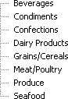

# Binding to DataTable


## 

**RadTreeView** can be bound to a **DataTable**, **DataSet** and a **DataView**. This example shows binding to a **DataTable** object.

The declaration of the **RadTreeView** object includes no **DataSourceID** property or <*Items*> section:

````ASPNET
<telerik:RadTreeView RenderMode="Lightweight" ID="RadTreeView1" runat="server" Skin="WebBlue" OnNodeDataBound="RadTreeView1_NodeDataBound">
</telerik:RadTreeView>
````


In the **Page_Load** event handler, create and fill the **DataTable** object, then bind it to the **RadTreeView**. You must call the **DataBind** method after setting the **DataSource** property. Minimally you must assign the **DataSource** and **DataTextField** properties. Optionally, you can assign **DataFieldID** and **DataValueField** properties. The following example binds to a table but does not create a hierarchy. See the [Binding to Hierarchical Data]() and [Getting Started, Binding to a Database]() for more information.


>caption 




````C#
using System.Data.SqlClient;using Telerik.Web.UI;
namespace RadTreeView_DataBindDataTable
{    
public partial class _Default : System.Web.UI.Page        
{        
    protected void Page_Load(object sender, EventArgs e)                
    {                        
        if (!IsPostBack)                        
        {                               
            BindToDataTable(RadTreeView1);                        
        }               
    }        
    private void BindToDataTable(RadTreeView treeView)           
    {                   
        SqlConnection connection = new SqlConnection(Properties.Settings.Default.NwindConnectionString);        
        SqlDataAdapter adapter = new SqlDataAdapter("select CategoryID, CategoryName, Description from Categories", connection);            
        DataTable dataTable = new DataTable();        
        adapter.Fill(dataTable);        
        treeView.DataTextField = "CategoryName";                  
        treeView.DataFieldID = "CategoryID";                   
        treeView.DataValueField = "Description";                     
        treeView.DataSource = dataTable;                    
        treeView.DataBind();            
    }  
}
````
````VB.NET
Imports System.Data.SqlClient
Imports Telerik.Web.UI
Imports System.Data
Namespace RadTreeView_DataBindDataTable
    Partial Public Class _Default
        Inherits System.Web.UI.Page
        Protected Sub Page_Load(ByVal sender As Object, ByVal e As EventArgs)
            If (Not IsPostBack) Then
                BindToDataTable(RadTreeView1)
            End If
        End Sub
        Private Sub BindToDataTable(ByVal treeView As RadTreeView)
            Dim connection As New SqlConnection(Properties.Settings.[Default].NwindConnectionString)
            Dim adapter As New SqlDataAdapter("select CategoryID, CategoryName, Description from Categories", connection)
            Dim dataTable As New DataTable()
            adapter.Fill(dataTable)
            treeView.DataTextField = "CategoryName"
            treeView.DataFieldID = "CategoryID"
            treeView.DataValueField = "Description"
            treeView.DataSource = dataTable
            treeView.DataBind()
        End Sub
    End Class
End Namespace
````


# See Also

 * [Overview]()

 * [Binding to a Database]()
