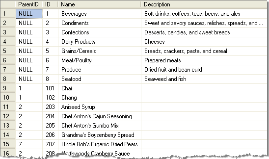
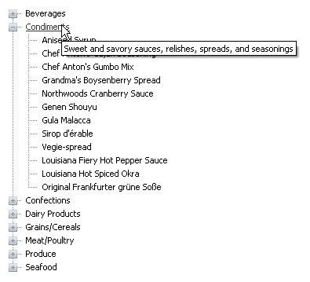

# Binding to Hierarchical Data


## 

Minimally, to bind hierarchical data you must assign the **DataSource**, **DataFieldID**, **DataFieldParentID** and **DataTextField** properties of the **RadTreeView**. Optionally, you can assign the **DataValueField** property.

The following example binds to a query of the Northwind database Categories and Products tables that are joined so that they form a hierarchy. The raw data from the query looks something like the example below.

>tip You can also use the Database.mdb Access file found in the RadControls installation directory under *\Live Demos\App_Data*. This Access file is already in a hierarchical structure and can be queried directly without additional manipulation in the join. Also, see [Getting Started, Binding to a Database]() for more examples.
>


>caption 



When bound to the **RadTreeView** the application looks like the screenshot below.


>caption 



In the **BindToDataTable()** method below, the hierarchical query is created, loaded into the DataTable and assigned to the **DataSource** property of the **RadTreeView**. The "Name" of the category or product is assigned to the **DataTextField** for display in the TreeView. The **DataFieldParentID** property is assigned null, for top level categories, or the id of the category. A unique identifier must be assigned to the **DataFieldID**; in this case the identifier is the CategoryID or a number constructed from the CategoryID and ProductID combined. Optionally, you can assign the **DataValueField**. Also, you can optionally create a handler for the **NodeDataBound** event and use any of the bound columns; in this example the Description column is assigned to the Node **ToolTip** property.


````C#
using System.Data.SqlClient;
using Telerik.Web.UI;
namespace RadTreeView_DataBindDataTable
{    
    public partial class _Default : System.Web.UI.Page    
    {        
        protected void Page_Load(object sender, EventArgs e)         
        {             
            if (!IsPostBack)             
            {                 
                BindToDataTable(RadTreeView1);             
            }         
        }

        private void BindToDataTable(RadTreeView treeView)        
        {            
            const string sql = "select ParentID = null, ID = CategoryID, Name = CategoryName, Description from Categories " + "union all " + "select ParentID = CategoryID, ID = (CategoryID * 100) + ProductID, Name = ProductName,  Description = '' from Products";                        
            SqlConnection connection = new SqlConnection(Properties.Settings.Default.NwindConnectionString);
            SqlDataAdapter adapter = new SqlDataAdapter(sql, connection);
            DataTable dataTable = new DataTable();
            adapter.Fill(dataTable);
            treeView.DataTextField = "Name";
            treeView.DataValueField = "Description";
            treeView.DataFieldID = "ID";
            treeView.DataFieldParentID = "ParentID";
            treeView.DataSource = dataTable;
            treeView.DataBind();
        }

        protected void RadTreeView1_NodeDataBound(object sender, RadTreeNodeEventArgs e)       
        {             
            e.Node.ToolTip = (e.Node.DataItem as DataRowView)["Description"].ToString();
        }    
    }
}
````
````VB.NET
Imports System.Data.SqlClient
Imports Telerik.Web.UI

Namespace RadTreeView_DataBindDataTable
Public Partial Class _Default Inherits System.Web.UI.Page
        Protected Sub Page_Load(ByVal sender As Object, ByVal e As EventArgs)
            If Not IsPostBack Then
                BindToDataTable(RadTreeView1)
            End If
        End Sub

        Private Sub BindToDataTable(ByVal treeView As RadTreeView)
            Const sql As String = "select ParentID = null, ID = CategoryID, Name = CategoryName, Description from Categories " + "union all " + "select ParentID = CategoryID, ID = (CategoryID * 100) + ProductID, Name = ProductName, Description = '' from Products"

            Dim connection As New SqlConnection(Properties.Settings.[Default].NwindConnectionString)
            Dim adapter As New SqlDataAdapter(sql, connection)
            Dim dataTable As New DataTable()

            adapter.Fill(dataTable)

            treeView.DataTextField = "Name"
            treeView.DataValueField = "Description"
            treeView.DataFieldID = "ID"
            treeView.DataFieldParentID = "ParentID"
            treeView.DataSource = dataTable
            treeView.DataBind()
        End Sub

        Protected Sub RadTreeView1_NodeDataBound(ByVal sender As Object, ByVal e As RadTreeNodeEventArgs)
            e.Node.ToolTip = (TryCast(e.Node.DataItem, DataRowView))("Description").ToString()
        End Sub
    End Class
End Namespace
````


For a live example of binding to hierarchical data see [Hierarchical Data Binding](http://demos.telerik.com/aspnet-ajax/TreeView/Examples/Programming/DataBinding/DefaultCS.aspx).


