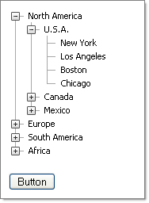

# Loading XML Content


You can load an XML content file to define your Tree. The XML file should be structured so that the root Node is named "Tree". Under that any number of <*Node*> tags can be nested. Within each Node, define attributes that map to **RadTreeNode** properties. For example:

````XML
<Tree>
  <Node Text="North America" Expanded="True" Value="1">
    <Node>
       <Node>
       </Node>
    </Node>
  </Node>
</Tree>
````


## Loading from an XML file

Create an XML file with content that complies with the rules described above and call the **LoadContentFile()** method to load the Nodes, passing in the path to the file:


>caption 



````XML
<Tree>
  <Node Text="North America" Expanded="True" Value="1">
      <Node Text="U.S.A." Expanded="True">
          <Node Text="New York" Value="2" />
          <Node Text="Los Angeles" />
          <Node Text="Boston" />
          <Node Text="Chicago" />
      </Node>
      <Node Text="Canada">
          <Node Text="Toronto" />
          <Node Text="Vancouver" />
          <Node Text="Calgary" />
          <Node Text="Ottawa" />
      </Node>
      <Node Text="Mexico">
          <Node Text="Campeche" />
          <Node Text="Guadalajara" />
          <Node Text="Mexico City" />
          <Node Text="Puebla" />
      </Node>
  </Node>
  <Node Text="Europe">
      <Node Text="England">
          <Node Text="London" />
          <Node Text="Liverpool" />
          <Node Text="Leeds" />
          <Node Text="Manchester" />
      </Node>
      <Node Text="France">
          <Node Text="Paris" />
          <Node Text="Cannes" />
          <Node Text="Grenoble" />
          <Node Text="Toulouse" />
      </Node>
      <Node Text="Germany">
          <Node Text="Berlin" />
          <Node Text="Bonn" />
          <Node Text="Bremen" />
          <Node Text="Munich" />
      </Node>
  </Node>
  <Node Text="South America">
      <Node Text="Brasil">
          <Node Text="Rio de Janeiro " />
          <Node Text="Sao Paulo" />
          <Node Text="Campinas" />
          <Node Text="Brasilia" />
      </Node>
      <Node Text="Argentina">
          <Node Text="Buenos Aires " />
          <Node Text="Cordoba" />
      </Node>
      <Node Text="Chile">
          <Node Text="Arica" />
          <Node Text="Copiapo" />
          <Node Text="Puerto Montt" />
      </Node>
  </Node>
  <Node Text="Africa">
      <Node Text="South Africa">
          <Node Text="Cape Town" />
          <Node Text="Johannesburg" />
          <Node Text="Pretoria " />
      </Node>
      <Node Text="Zambia">
          <Node Text="Lusaka" />
      </Node>
      <Node Text="Zimbabwe">
          <Node Text="Harare" />
      </Node>
  </Node>
</Tree> 
````


A button click event handler calls the **LoadContentFile()** method:


````C#
protected void Button1_Click(object sender, EventArgs e)
{    
    RadTreeView1.LoadContentFile("tree.xml");
}	
````
````VB.NET
Protected Sub Button1_Click(ByVal sender As Object, ByVal e As EventArgs)
    RadTreeView1.LoadContentFile("tree.xml")
End Sub
````


## Loading from an XML string

Create a string with valid XML content (or fetch it from a database, for example) and use the **LoadXML()** method to populate the **TreeView** from the string:


````C#
StringBuilder sb = new StringBuilder();
sb.Append("<Tree>");
sb.Append(" <Node Text='Root Node 1'>");
sb.Append(" </Node>");
sb.Append(" <Node Text='Root Node 2'>");
sb.Append(" </Node>");
sb.Append(" <Node Text='Root Node 3'>");
sb.Append(" <Node Text='Child Node'>");
sb.Append(" </Node>");
sb.Append(" </Node>");
sb.Append(" </Tree>");
string xmlString = sb.ToString();
RadTreeView1.LoadXml(xmlString);
````
````VB.NET
Dim sb As New StringBuilder()
sb.Append("<Tree>")
sb.Append(" <Node Text='Root Node 1'>")
sb.Append(" </Node>")
sb.Append(" <Node Text='Root Node 2'>")
sb.Append(" </Node>")
sb.Append(" <Node Text='Root Node 3'>")
sb.Append(" <Node Text='Child Node'>")
sb.Append(" </Node>")
sb.Append(" </Node>")
sb.Append(" </Tree>")
Dim xmlString As String = sb.ToString()
RadTreeView1.LoadXml(xmlString 
````


For a live example of loading **RadTreeView** Nodes from XML, see [Populating from XML](https://demos.telerik.com/aspnet-ajax/TreeView/Examples/Programming/XmlFile/DefaultCS.aspx).
