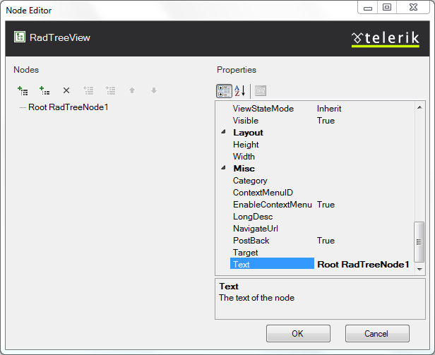

# RadTreeView Item Builder

The **RadTreeView Item Builder** lets you add, edit, delete and set properties for nodes at design-time.

* From the **RadTreeView** [Smart Tag]() , click on the **Build RadTreeView** link.

* Right-click on the **RadTreeView** control and select **Build RadTreeView** from the context menu.

## RadTreeView Item Builder

* Click the Add Root Item button to append a top-level node.
 

* Click the Add Child Item button to append a child node to a currently selected node.
 

* Click the Remove Item button to delete the currently selected node.
 

* Use the Promote button to make the selected node a sibling of its parent.
 

* Use the Demote button to make the selected node a child of its preceding sibling.
 

* Select individual nodes to change their properties using the property pane on the right of the **RadTreeView Item Builder**.

* Use the sorting controls button above the property pane to sort the properties by category or alphabetically.
 

Key properties for each node are:

* Text

* Value

* NavigateUrl

* ToolTip

* PostBack

* ExpandMode

* ContextMenuID

