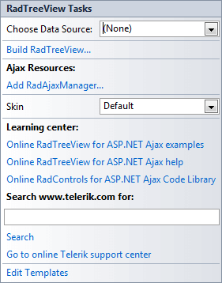
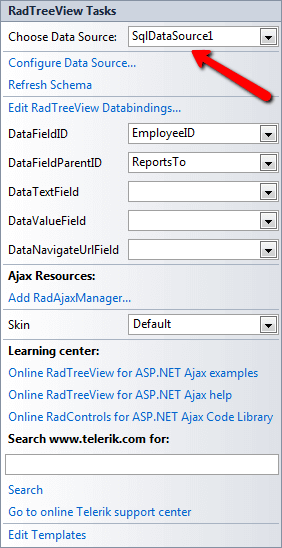

# Smart Tag

The __RadTreeView__Smart Tag allows easy access to frequently needed tasks. You can display the Smart Tag by right clicking on a __RadTreeView__control in the design window, and choosing __Show Smart Tag__. You can also display the Smart Tag by clicking the small rightward-pointing button located at the upper right of the __RadTreeView__ component.

## Unbound Smart Tag

## RadTreeView Tasks

* __Choose Data Source__ lets you bind the treeview declaratively by selecting a data source from the drop-down list of available data source components. If you select __<New Data Source...>__ the standard Windows [Data Source Configuration Wizard](http://msdn2.microsoft.com/en-us/library/ms247282(VS.80).aspx) appears, where you can create and configure a data source component.

* __Build RadTreeView__ opens the [RadTreeView Item builder](), where you can add static nodes to the treeview and set their properties.

## Ajax Resources

* __Add RadAjaxManager...__includes the RadAjaxManager component on the form, allowing fine-grain control over how controls are updated via AJAX.

* __Replace ScriptManager with RadScriptManager:__RadScriptManager performs the same tasks as ScriptManager but can also combine all for ASP.NET AJAX JavaScript resources into a single web resource request for better performance.

* __Add RadStyleSheetManager:__The RadStyleSheetManager component enables you to combine all CSS output for for ASP.NET AJAX controls into a single stylesheet web resource request.

## Skin

__Skin__ lets you select from a list of available [skins](A2ACD8E0-A5F3-4093-A5DA-FF45D737F6FA) to customize the look of your __RadTreeView__.

## Learning Center

Links navigate you directly to RadTreeView examples, help, or code library. You can also search the Telerik web site for a given string.

>caption 

## Edit Templates

Clicking the Edit Templates link brings up a [template editor]() where you can customize the Item Template.

## Bound Smart Tag

When __RadTreeView__is bound, the Smart Tag looks like the following:

>caption 

## RadTreeView Tasks

* __Choose Data Source__ lets you change the declarative binding by selecting a data source from a drop-down list of all available data source components. If you select "__<New Data Source...>__" the standard Windows [Data Source Configuration Wizard](http://msdn2.microsoft.com/en-us/library/ms247282(VS.80).aspx) appears, where you can create and configure a data source component. If you select "__(None)__", you remove the existing binding.

* __Configure Data Source...__ opens the standard Windows [Data Source Configuration Wizard](http://msdn2.microsoft.com/en-us/library/ms247282(VS.80).aspx), where you can configure the currently bound data source component.

* __Refresh Schema__refreshes the schema for the currently bound data source component.

* __Edit RadTreeView Databindings__... opens the [NavigationItemBinding Collection Editor](), where you can specify [databindings]() to map between the fields in the data source and __RadTreeNode__properties.

* Once the Data Source is chosen, you can select each one of the following: __DataFieldID__,__DataFieldParentID__,__DataTextField__,__DataValueField__ and __DataNavigationUrlField__. For the first two, you need to select the fields in the Data Source that will be used when creating the hierarchy of the RadTreeView. The rest will serve data respectively for the __Text,____Value__ and __NavigateUrl__ properties of RadTreeNodes.

* __Edit Templates__ brings up the [template design surface](), where you can create or edit the [templates]() your __RadTreeView__uses.

# See Also

 * [RadTreeView Item Builder]()
