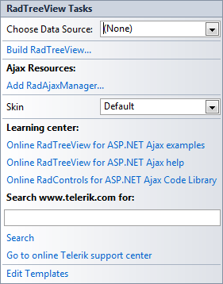
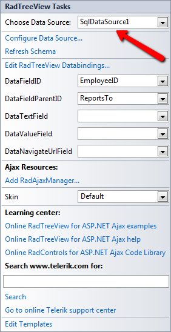

# Smart Tag

The **RadTreeView** Smart Tag allows easy access to frequently needed tasks. You can display the Smart Tag by right clicking on a **RadTreeView** control in the design window, and choosing **Show Smart Tag**. You can also display the Smart Tag by clicking the small rightward-pointing button located at the upper right of the **RadTreeView** component.

## RadTreeView Tasks

* **Choose Data Source** lets you bind the **TreeView** declaratively by selecting a data source from the drop-down list of available data source components. If you select **<New Data Source...>** the standard Windows [Data Source Configuration Wizard](http://msdn2.microsoft.com/en-us/library/ms247282(VS.80).aspx) appears, where you can create and configure a data source component.

* **Build RadTreeView** opens the [RadTreeView Item builder](), where you can add static nodes to the **TreeView** and set their properties.

## Ajax Resources

* **Add RadAjaxManager...** includes the **RadAjaxManager** component on the form, allowing fine-grain control over how controls are updated via AJAX.

* Replace ScriptManager with RadScriptManager: **RadScriptManager performs the same tasks as **ScriptManager** but can also combine all for ASP.NET AJAX JavaScript resources into a single web resource request for better performance.

* **Add RadStyleSheetManager**: The **RadStyleSheetManager** component enables you to combine all CSS output for for ASP.NET AJAX controls into a single stylesheet web resource request.

## Skin

**Skin** lets you select from a list of available [skins](A2ACD8E0-A5F3-4093-A5DA-FF45D737F6FA) to customize the look of your **RadTreeView**.

## Learning Center

Links navigate you directly to **RadTreeView** examples, help, or code library. You can also search the Telerik web site for a given string.

>caption 

## Edit Templates

Clicking the Edit Templates link brings up a [template editor]() where you can customize the Item Template.

## Bound Smart Tag

When **RadTreeView** is bound, the Smart Tag looks like the following:

>caption 

## RadTreeView Tasks

* **Choose Data Source** lets you change the declarative binding by selecting a data source from a drop-down list of all available data source components. If you select "**<New Data Source...>**" the standard Windows [Data Source Configuration Wizard](http://msdn2.microsoft.com/en-us/library/ms247282(VS.80).aspx) appears, where you can create and configure a data source component. If you select "**(None)**", you remove the existing binding.

* **Configure Data Source...** opens the standard Windows [Data Source Configuration Wizard](http://msdn2.microsoft.com/en-us/library/ms247282(VS.80).aspx), where you can configure the currently bound data source component.

* **Refresh Schema**refreshes the schema for the currently bound data source component.

* **Edit RadTreeView Databindings**... opens the [NavigationItemBinding Collection Editor](), where you can specify [databindings]() to map between the fields in the data source and **RadTreeNode** properties.

* Once the Data Source is chosen, you can select each one of the following: **DataFieldID**, **DataFieldParentID**, **DataTextField**, **DataValueField** and **DataNavigationUrlField**. For the first two, you need to select the fields in the Data Source that will be used when creating the hierarchy of the **RadTreeView**. The rest will serve data respectively for the **Text, Value** and **NavigateUrl** properties of **RadTreeNodes**.

* **Edit Templates** brings up the [template design surface](), where you can create or edit the [templates]() your **RadTreeView**uses.

# See Also

 * [RadTreeView Item Builder]()
