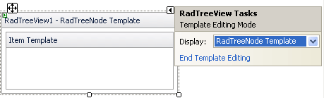
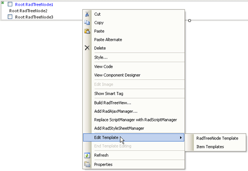

# Template Design Surface

## 

The __Template Design Surface__ lets you design templates for the nodes that appear in RadTreeView. There are two ways to display the Template Design Surface:

* From the RadTreeView Smart Tag, choose Edit Templates. A Pop-up appears, along with the Template Design Surface:
>caption 

* Right-click the RadTreeView instance and from the context menu, select Edit Template | __RadTreeNode Template__ or __Item Templates__. The __Template Design surface__ appears.
>caption 

On the design surface, you can drag controls from the toolbox or enter literal text. By moving to Source view, you can add other HTML content to the template and set attributes to display the node value.

When you have finished designing your template, choose __End Template Editing__ from the RadTreeView context menu or the Smart Tag pop-up.
