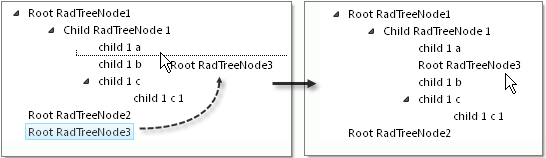

# Between Nodes


## 

**RadTreeView** enables you to drop Nodes in between other Nodes. Set the **EnableDragAndDropBetweenNodes** property to **True** to support this behavior. In the **OnNodeDrop** event, use the **RadTreeNodeDragDropEventArgs DropPosition** property to find the relationship of the dropped Nodes and the destination Nodes. In the example below the **OnNodeDrop** event handler checks to see that the destination Node is not **null**. The number of Nodes being dragged determines how many times the **PerformDragAndDrop()** method is called. In the **PerformDragAndDrop()** method the **DropPosition** drives the rest of the logic. If the **DropPosition** is **Over** then the Nodes are added directly to the destination Nodes collection. If **DropPosition** is **Above**, the Nodes are inserted before the destination Node and if **Below** the Nodes are inserted after the destination Node.




````C#
using System.Web.UI;
using Telerik.Web.UI;
namespace RadTreeView_Dragging{
   public partial class _Default : System.Web.UI.Page
   {
       protected void RadTreeView1_NodeDrop(object sender, Telerik.Web.UI.RadTreeNodeDragDropEventArgs e)
       {
           RadTreeNode sourceNode = e.SourceDragNode;
           RadTreeNode destNode = e.DestDragNode;
           RadTreeViewDropPosition dropPosition = e.DropPosition;
           if (destNode != null)
           {
               if (sourceNode.TreeView.SelectedNodes.Count <= 1)
               {
                   PerformDragAndDrop(dropPosition, sourceNode, destNode);
               }
               else if (sourceNode.TreeView.SelectedNodes.Count > 1)
               {
                   foreach (RadTreeNode node in sourceNode.TreeView.SelectedNodes)
                   {
                       PerformDragAndDrop(dropPosition, node, destNode);
                   }
               }
               destNode.Expanded = true;
               sourceNode.TreeView.ClearSelectedNodes();
           }
       }
       private static void PerformDragAndDrop(RadTreeViewDropPosition dropPosition, RadTreeNode sourceNode, RadTreeNode destNode)
       {
           switch (dropPosition)
           {
               case RadTreeViewDropPosition.Over:
                   // child
                   if (!sourceNode.IsAncestorOf(destNode))
                   {
                       sourceNode.Owner.Nodes.Remove(sourceNode);
                       destNode.Nodes.Add(sourceNode);
                   }
                   break;
               case RadTreeViewDropPosition.Above:
                   // sibling - above
                   sourceNode.Owner.Nodes.Remove(sourceNode);
                   destNode.InsertBefore(sourceNode);
                   break;
               case RadTreeViewDropPosition.Below:
                   // sibling - below
                   sourceNode.Owner.Nodes.Remove(sourceNode);
                   destNode.InsertAfter(sourceNode);
                   break;
           }
       }
   }
}      
````
````VB.NET
Imports System.Web.UI
Imports Telerik.Web.UI
namespace RadTreeView_Dragging
    Partial Public Class _Default
        Inherits System.Web.UI.Page
        Protected Sub RadTreeView1_NodeDrop(ByVal sender As Object, ByVal e As Telerik.Web.UI.RadTreeNodeDragDropEventArgs)
            Dim sourceNode As RadTreeNode = e.SourceDragNode
            Dim destNode As RadTreeNode = e.DestDragNode
            Dim dropPosition As RadTreeViewDropPosition = e.DropPosition
            If destNode <> Nothing Then
                If sourceNode.TreeView.SelectedNodes.Count <= 1 Then
                    PerformDragAndDrop(dropPosition, sourceNode, destNode)
                ElseIf sourceNode.TreeView.SelectedNodes.Count > 1 Then
                    For Each node As RadTreeNode In sourceNode.TreeView.SelectedNodes
                        PerformDragAndDrop(dropPosition, node, destNode)
                    Next
                End If
                destNode.Expanded = True
                sourceNode.TreeView.ClearSelectedNodes()
            End If
        End Sub
        Private Shared Sub PerformDragAndDrop(ByVal dropPosition As RadTreeViewDropPosition, ByVal sourceNode As RadTreeNode, ByVal destNode As RadTreeNode)
            Select Case dropPosition
                Case RadTreeViewDropPosition.Over
                    ' child
                    If Not sourceNode.IsAncestorOf(destNode) Then
                        sourceNode.Owner.Nodes.Remove(sourceNode)
                        destNode.Nodes.Add(sourceNode)
                    End If
                    Exit Select
                Case RadTreeViewDropPosition.Above
                    ' sibling - above
                    sourceNode.Owner.Nodes.Remove(sourceNode)
                    destNode.InsertBefore(sourceNode)
                    Exit Select
                Case RadTreeViewDropPosition.Below
                    ' sibling - below
                    sourceNode.Owner.Nodes.Remove(sourceNode)
                    destNode.InsertAfter(sourceNode)
                    Exit Select
            End Select
        End Sub
    End Class
End Namespace
````


# See Also

 * [Overview]()

 * [NodeDrop]()
