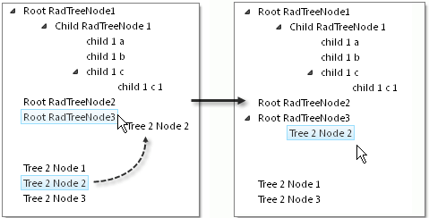

# Between Trees


## 

RadTreeView handles dragging to other RadTreeViews. Set the __EnableDragAndDrop__ property of the RadTreeView that should allow dragging.

>note In the __OnNodeDrop__ event, the __RadTreeNodeDragDropEventArgs SourceDragNode__ will still be the node from the RadTreeView from where the node is being dragged. The __DestDragNode__ will be the node in the destination treeview. You can confirm this behavior by examining each node's __TreeView.ID__ property.
>


In the example below, both RadTreeViews have their __EnableDragAndDrop__ property set to __True__. Both RadTreeViews hook their __OnNodeDrop__ to the same event handler. In the screenshot for this example, the second RadTreeView "Tree 2" is located directly below the first. Dragging a Node from "Tree 2" to the first tree causes the Node to be moved to the destination Node's __Nodes__ collection.



````ASPNET
	    <telerik:RadTreeView ID="RadTreeView1" runat="server" EnableDragAndDrop="true" OnNodeDrop="RadTreeView1_NodeDrop"
	        Skin="Vista">
	        <Nodes>
	            <telerik:RadTreeNode runat="server" Text="Root RadTreeNode1" ExpandMode="ClientSide">
	                <Nodes>
	                    <telerik:RadTreeNode runat="server" Text="Child RadTreeNode 1" ExpandMode="ClientSide">
	                        <Nodes>
	                            <telerik:RadTreeNode runat="server" ExpandMode="ClientSide" Text="child 1 a">
	                            </telerik:RadTreeNode>
	                            <telerik:RadTreeNode runat="server" ExpandMode="ClientSide" Text="child 1 b">
	                            </telerik:RadTreeNode>
	                            <telerik:RadTreeNode runat="server" ExpandMode="ClientSide" Text="child 1 c">
	                                <Nodes>
	                                    <telerik:RadTreeNode runat="server" ExpandMode="ClientSide" Text="child 1 c 1">
	                                    </telerik:RadTreeNode>
	                                </Nodes>
	                            </telerik:RadTreeNode>
	                        </Nodes>
	                    </telerik:RadTreeNode>
	                </Nodes>
	            </telerik:RadTreeNode>
	            <telerik:RadTreeNode runat="server" Text="Root RadTreeNode2" ExpandMode="ClientSide">
	            </telerik:RadTreeNode>
	            <telerik:RadTreeNode runat="server" Text="Root RadTreeNode3" ExpandMode="ClientSide">
	            </telerik:RadTreeNode>
	        </Nodes>
	    </telerik:RadTreeView>
	    <br />
	    <telerik:RadTreeView ID="RadTreeView2" runat="server" EnableDragAndDrop="true" OnNodeDrop="RadTreeView1_NodeDrop"
	        Skin="Vista">
	        <Nodes>
	            <telerik:RadTreeNode runat="server" ExpandMode="ClientSide" Text="Tree 2 Node 1">
	            </telerik:RadTreeNode>
	            <telerik:RadTreeNode runat="server" ExpandMode="ClientSide" Text="Tree 2 Node 2">
	            </telerik:RadTreeNode>
	            <telerik:RadTreeNode runat="server" ExpandMode="ClientSide" Text="Tree 2 Node 3">
	            </telerik:RadTreeNode>
	        </Nodes>
	    </telerik:RadTreeView>
````


>tabbedCode

````C#
	using System.Web.UI;
	using Telerik.Web.UI;
	namespace RadTreeView_Dragging
	{
	   public partial class _Default : System.Web.UI.Page
	   {
	       protected void RadTreeView1_NodeDrop(object sender, Telerik.Web.UI.RadTreeNodeDragDropEventArgs e)
	       {
	           foreach (RadTreeNode node in e.DraggedNodes)
	           {
	               e.DestDragNode.Nodes.Add(node);
	           }
	       }
	   }
	} 
````


````VB.NET
	Imports System.Web.UI
	Imports Telerik.Web.UI
	namespace RadTreeView_Dragging
	        Partial Public Class _Default
	            Inherits System.Web.UI.Page
	            Protected Sub RadTreeView1_NodeDrop(ByVal sender As Object, ByVal e As Telerik.Web.UI.RadTreeNodeDragDropEventArgs)
	                For Each node As RadTreeNode In e.DraggedNodes
	                    e.DestDragNode.Nodes.Add(node)
	                Next
	            End Sub
	        End Class
	    End Namespace
````


>end

# See Also

 * [Overview]()

 * [NodeDrop]()
