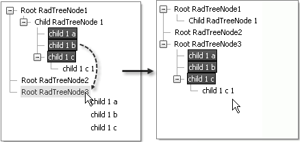

# Drag and Drop Overview


## 

To allow drag and drop functionality in RadTreeView, set the __EnableDragAndDrop__ property to __True__. Once enabled, dragging behavior by default allows Nodes to be dropped on other Nodes but not between Nodes. Setting __EnableDragAndDropBetweenNodes__ to __True__ allows Nodes to be dropped between other Nodes. A line between the Nodes will display briefly as a visual indicator that the Node can be dropped in the location of the line. To allow multiple Nodes to be dragged at one time, set the __MultipleSelect__ property to __True__.

You can further tailor the drag and drop behavior per Node by setting the boolean RadTreeNode properties __AllowDrag__ and __AllowDrop__. Both __AllowDrag__ and __AllowDrop__ properties are __True__ by default.

When RadTreeView detects a valid drag and drop operation (the selected Node is dropped onto another Node or in between Nodes) it generates a __NodeDrop__ server-side event. The event is sent to the source TreeView, i.e. the TreeView from which the Node is being dragged. The event handler for __NodeDrop__ can then perform specific action, by fetching both the source and destination drag/drop Nodes. In the __NodeDrop__ event handler the __RadTreeNodeDragDropEventArgs__ parameter provides access to the following objects:

* __SourceDragNode__: The Node being dragged;

* __DestDragNode__: The Node being dragged to;

* __DraggedNodes__: A collection of Nodes being dragged (this is useful when multi-selection is enabled - __MultiSelect__property of the RadTreeView is set to __True__);

* __DropPosition__: Indicates the relationship of the Nodes being dropped and can be a __RadTreeViewDropPosition__ enumeration value __Above__, __Below__ or __Over__;

* __HtmlElementID__: The ID of the HTML element that the Node is being dropped on.

The following example handles the __OnNodeDrop__ event and adds the __DraggedNodes__ to the __DestDragNode__'s__Nodes__ collection.




````ASPNET
	    <telerik:RadTreeView ID="RadTreeView1" runat="server" EnableDragAndDrop="true" EnableDragAndDropBetweenNodes="true"
	        MultipleSelect="true" OnNodeDrop="RadTreeView1_NodeDrop" Skin="Vista">
	        <Nodes>
	            <telerik:RadTreeNode runat="server" Text="Root RadTreeNode1" ExpandMode="ClientSide">
	                <Nodes>
	                    <telerik:RadTreeNode runat="server" Text="Child RadTreeNode 1" ExpandMode="ClientSide">
	                        <Nodes>
	                            <telerik:RadTreeNode runat="server" ExpandMode="ClientSide" Text="child 1 a">
	                            </telerik:RadTreeNode>
	                            <telerik:RadTreeNode runat="server" ExpandMode="ClientSide" Text="child 1 b">
	                            </telerik:RadTreeNode>
	                            <telerik:RadTreeNode runat="server" ExpandMode="ClientSide" Text="child 1 c">
	                                <Nodes>
	                                    <telerik:RadTreeNode runat="server" ExpandMode="ClientSide" Text="child 1 c 1">
	                                    </telerik:RadTreeNode>
	                                </Nodes>
	                            </telerik:RadTreeNode>
	                        </Nodes>
	                    </telerik:RadTreeNode>
	                </Nodes>
	            </telerik:RadTreeNode>
	            <telerik:RadTreeNode runat="server" Text="Root RadTreeNode2" ExpandMode="ClientSide">
	            </telerik:RadTreeNode>
	            <telerik:RadTreeNode runat="server" Text="Root RadTreeNode3" ExpandMode="ClientSide">
	            </telerik:RadTreeNode>
	        </Nodes>
	    </telerik:RadTreeView>
````


>tabbedCode

````C#
	using Telerik.Web.UI;
	using Telerik.Web.UI;
	namespace RadTreeView_Dragging
	{
	   public partial class _Default : System.Web.UI.Page
	   {
	       protected void RadTreeView1_NodeDrop(object sender, Telerik.Web.UI.RadTreeNodeDragDropEventArgs e)
	       {
	           foreach (RadTreeNode node in e.DraggedNodes)
	           {
	               e.DestDragNode.Nodes.Add(node);
	           }
	       }
	   }
	} 			
````


````VB.NET
	Imports Telerik.Web.UI
	namespace RadTreeView_Dragging
	        Partial Public Class _Default
	            Inherits System.Web.UI.Page
	            Protected Sub RadTreeView1_NodeDrop(ByVal sender As Object, ByVal e As Telerik.Web.UI.RadTreeNodeDragDropEventArgs)
	                For Each node As RadTreeNode In e.DraggedNodes
	                    e.DestDragNode.Nodes.Add(node)
	                Next
	            End Sub
	        End Class
	    End Namespace
````


>end

To see a live example of the drag and drop support of RadTreeView visit the [Drag & Drop live demo](http://demos.telerik.com/aspnet-ajax/TreeView/Examples/Functionality/DragAndDropNodes/DefaultCS.aspx).

# See Also

 * [Overview]()

 * [NodeDrop]()
