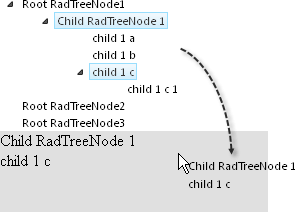

# To Any HTML Element


## 

To drop onto any arbitrary HTML element including standard HTML tags, ASP.NET controls and **RadControls**, use the **HtmlElementID** property of the **RadTreenodeDragDropEventArgs** that is available in the **OnNodeDrop** event. In the example below, Nodes are dragged down to a standard Panel component with ID property "myPanel". When the **OnNodeDrop** event fires, if **HtmlElementID** is "myPanel" then the **DraggedNodes** are iterated and in this case, LiteralControls are added to the Panel Collection.




````C#
using System.Web.UI;
using Telerik.Web.UI;
namespace RadTreeView_Dragging
{
   public partial class _Default : System.Web.UI.Page
   {
       protected void RadTreeView1_NodeDrop(object sender, Telerik.Web.UI.RadTreeNodeDragDropEventArgs e)
       {
           if (e.HtmlElementID == "myPanel")
           {
               foreach (RadTreeNode node in e.DraggedNodes)
               {
                   myPanel.Controls.Add(new LiteralControl(node.Text));
                   myPanel.Controls.Add(new LiteralControl("<br>"));
               }
           }
       }
   }
}      
````
````VB.NET
Imports System.Web.UI
Imports Telerik.Web.UI
Namespace RadTreeView_Dragging
    Partial Public Class _Default
        Inherits System.Web.UI.Page
        Protected Sub RadTreeView1_NodeDrop(ByVal sender As Object, ByVal e As Telerik.Web.UI.RadTreeNodeDragDropEventArgs)
            If e.HtmlElementID = "myPanel" Then
                For Each node As RadTreeNode In e.DraggedNodes
                    myPanel.Controls.Add(New LiteralControl(node.Text))
                    myPanel.Controls.Add(New LiteralControl("<br>"))
                Next
            End If
        End Sub
    End Class
End Namespace
````


To see a live example of drag and drop to an HTML element visit the [Drag & Drop live demo](https://demos.telerik.com/aspnet-ajax/TreeView/Examples/Functionality/DragAndDropNodes/DefaultCS.aspx).

# See Also

 * [Overview]()

 * [NodeDrop]()
