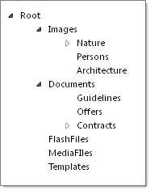
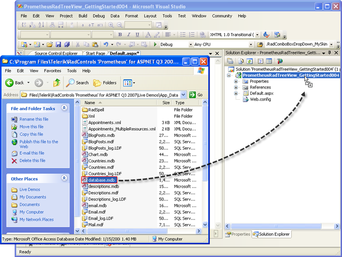
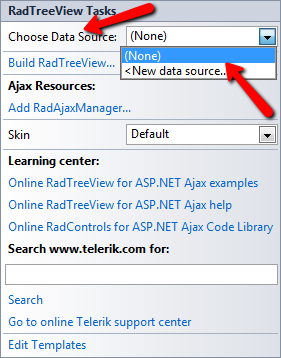
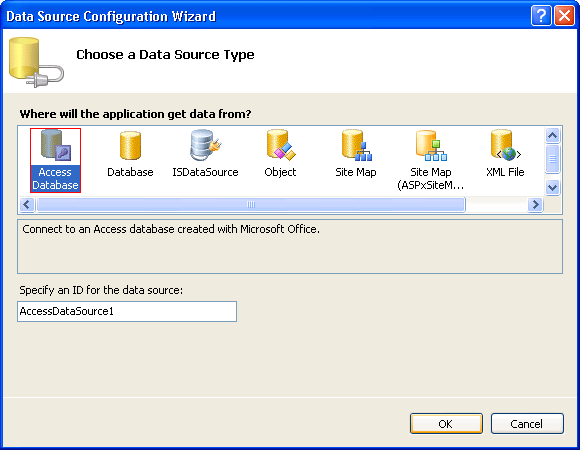
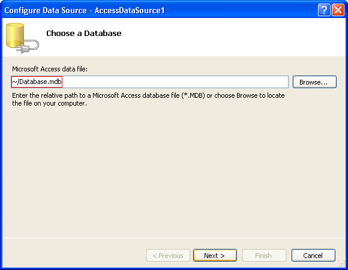
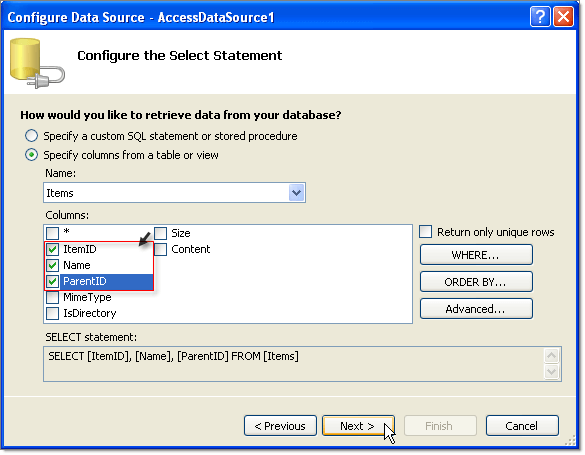
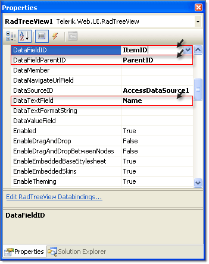

# Binding to a Database

## 

The following tutorial demonstrates binding **RadTreeView** to an Access Data Source containing hierarchical data. The table contains columns for "ItemID", "ParentID" and "Name". "Name" is used to populate the text of each node while "ItemID" and "ParentID" describe the hierarchy. The screenshot below shows the appearance of the running example application.

>caption 

1. In a new AJAX-Enabled Web Application, drop a **RadTreeView** to the default form.

1. Locate the "Database.mdb" Access Data Base in the **RadControls for ASP.NET AJAX** suite version installation directory under *\Live Demos\App_Data*. The typical path would be similar to this one: *\Telerik\RadControls for ASPNET <current version>\Live Demos\App_Data\Database.mdb*

1. Drag the "Database.mdb" file to the project in the Solution Explorer.
>caption 

1. Open the [Smart Tag]() and set the **Skin** to **Vista** from the drop down list. Then select **<New data source...>** from the **Choose Data Source** drop down list. *This step will display the Data Source Configuration Wizard.*
>caption 

1. In the Data Source Configuration Wizard, "Choose a Data Source Type" page, select the **Access Database** icon and click the **OK** button. *This step will display the Configure Data Source Wizard.*
>caption 

1. In the "Choose a Database" page, Microsoft Access Data File text box enter "~/Database.mdb". Click the **Next** button to continue.
>caption 

1. In the "Configure the Select Statement" page of the wizard, choose "Items" from the drop down list. Check the "ItemID", "Name" and ParentID columns. Click the **Next** button.
>caption 

1. In the "Test Query" page of the wizard, click the **Finish** button to close the wizard. The Access Data Source component will be created automatically and assigned to the **DataSourceID** property of **RadTreeView** 

1. In the Properties Window for the **RadTreeView**:

1. Set the **DataFieldID** property to "ItemID".

1. Set the **DataFieldParentID** property to "ParentID".

1. Set the **DataTextField** property to "Name".
>caption 

1. Press **F5** to run the application.

