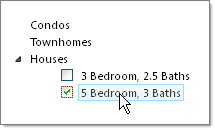
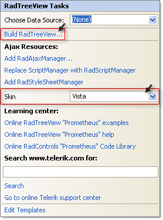
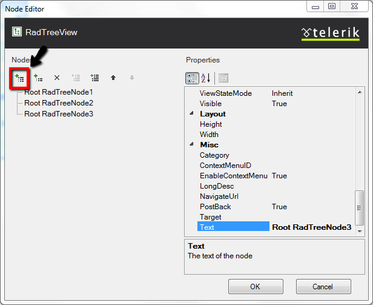
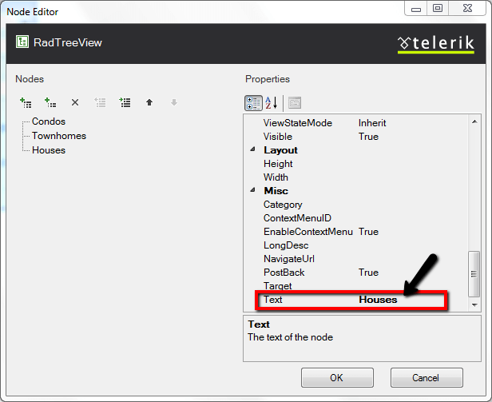
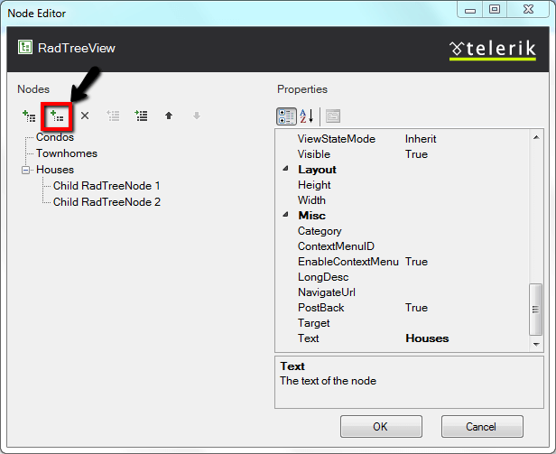
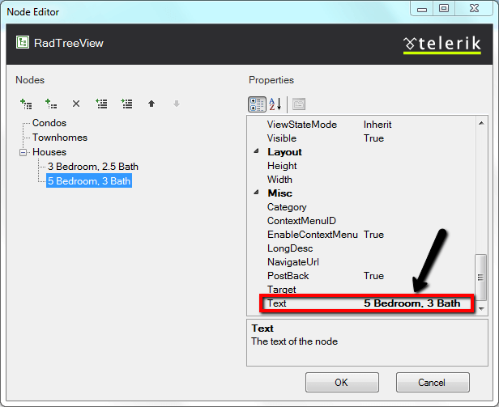

# Building a Simple TreeView

## 

The following tutorial will demonstrate how to create a simple treeview using the designer and shows how to:

* Create root level nodes.

* Create child nodes.

* Apply a pre-defined style to the treeview.

* Display checkboxes next to nodes.

>caption 

1. In a new AJAX Enabled Web Application, drop a RadTreeView to the default form.

1. Open the [Smart Tag]() and set the __Skin__ to __Vista__ from the drop down list. Then select the __Build RadTreeView__ link. *This step will display the RadTreeView Item Builder Dialog.*
>caption 

1. In the RadTreeView Item Builder dialog click the Add Root Node button to add three nodes.
>caption 

1. Click the first node and set the __Text__ property to "Condos". Set the __Checkable__ property to False.

1. Click the second node and set the __Text__ property to "Townhomes". Set the __Checkable__ property to False.

1. Click the third node and set the __Text__ property to "Houses". Set the __Checkable__ property to False.
>caption 

1. While the third node, "Houses", is still selected, click the Add Child Item button twice.
>caption 

1. Select the first child item and set the __Text__ property to "3 Bedroom, 2.5 Baths".

1. Select the second child item and set the __Text__ property to "5 Bedroom, 3 Baths".
>caption 

1. Click __OK__ to close the RadTreeView Item Builder dialog.

1. In the Properties Window, set the RadTreeView __CheckBoxes__ property to __true__.

1. Press __F5__ to run the application.
