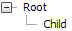
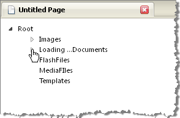

# Client-side Binding


## 

Loading on-demand, client-side is similar to [server-side load-on-demand](). The difference is in setting the __ExpandMode__ property of each node to __ServerSideCallback__ instead to __ServerSide__. When a node is clicked, an asynchronous callback is performed automatically to retrieve the data for just that node. Minimally, you must set the __ExpandMode__ to __ServerSideCallback__ and handle the __NodeExpand__ event as shown in the example below. The example has a single root element and only one child element that is loaded on demand.


>caption 



>tabbedCode

````C#
	     
	
	using System;
	using Telerik.Web.UI;
	namespace RadTreeView_Templates1
	{
	   public partial class _Default : System.Web.UI.Page
	   {
	       protected void Page_Load(object sender, EventArgs e)
	       {
	           if (!Page.IsPostBack)
	           {
	               RadTreeNode node = new RadTreeNode("Root");
	               node.ExpandMode = TreeNodeExpandMode.ServerSideCallBack;
	               RadTreeView1.Nodes.Add(node);
	           }
	       }
	       protected void RadTreeView1_NodeExpand(object sender, RadTreeNodeEventArgs e)
	       {
	           e.Node.Nodes.Add(new RadTreeNode("Child"));
	       }
	   }
	} 
		
````


````VB.NET
	Imports System
	Imports Telerik.Web.UI
	namespace RadTreeView_Templates1
	        Partial Public Class _Default
	            Inherits System.Web.UI.Page
	            Protected Sub Page_Load(ByVal sender As Object, ByVal e As EventArgs)
	                If Not Page.IsPostBack Then
	                    Dim node As New RadTreeNode("Root")
	                    node.ExpandMode = TreeNodeExpandMode.ServerSideCallBack
	                    RadTreeView1.Nodes.Add(node)
	                End If
	            End Sub
	            Protected Sub RadTreeView1_NodeExpand(ByVal sender As Object, ByVal e As RadTreeNodeEventArgs)
	                e.Node.Nodes.Add(New RadTreeNode("Child"))
	            End Sub
	        End Class
	    End Namespace
	
	
````


>end

To load an arbitrary number of levels on-demand client-side, the general steps are:

* Query the root node data, i.e. for the nodes that the user will see first. When using self-referential hierarchical databases this can be done by querying for nodes where the "parent id" is null. Querying may involve a literal SQL query, but could also be any extraction of data using the root node.

* Iterate through the root node data and add new node objects for each record. Assign to the __Text__ property the data column representing readable text and assign the column containing unique identifiers to the __Value__ property of each node. The Value property will be used later as a parent id when opening a node. Set the Node __ExpandMode__ property to __ServerSideCallback;__ expanding a node will cause an asynchronous callback. During the callback, the server __NodeExpand__ event handler will fire.

* Create a __NodeExpand__ event handler. This event will pass a reference to the clicked-on node as a parameter. Use the node __Value__ property to query for all child nodes of this parent node.

* Iterate through the child nodes, again populating the __Text__ and __Value__ properties of each node. Set each child node's __ExpandMode__ property to __ServerSideCallback.__ You do not need to set the __ExpandNode__ for the clicked-on, parent node to __ClientSide;__ the ServerSideCallback expand mode automatically handles the case so that the server is not queried twice. Also set the __Expanded__ property of the parent node to __True__.

The example below loads data from the Access Database.mdb database. This database can be found in the RadControls installation directory under Live Demos\App_Data. Any data that has ID, Parent ID and text column data would work in this scenario. In this example the LoadRootNodes() method loads only the node called "Root". When the user clicks that node the first time, the __NodeExpand__ event is fired:

* The data for the child nodes of the parent "Root" are retrieved.

* Nodes are created for each record and attached as child nodes to the parent node. The __ExpandMode__ property of each child node is set to __ServerSideCallback__.

* The parent "Root" node's __Expanded__ property is set to __True__, opening the node to display the child nodes.

The same general pattern for NodeExpand is repeated when the user clicks a node that has not yet been expanded.


>caption 



>tabbedCode

````C#
	
	using System;
	using System.Data;
	using System.Data.OleDb;
	using Telerik.Web.UI;
	namespace RadTreeView_DataBindDataTable
	{
	   public partial class _Default : System.Web.UI.Page
	   {
	       protected void Page_Load(object sender, EventArgs e)
	       {
	           if (!IsPostBack)
	           {
	               LoadRootNodes(RadTreeView1);
	           }
	       }
	       private void LoadRootNodes(RadTreeView treeView)
	       {
	           const string sql = "Select Name, ItemID from Items where ParentID IS NULL";
	           OleDbConnection connection = new OleDbConnection(Properties.Settings.Default.AccessConnection);
	           OleDbDataAdapter adapter = new OleDbDataAdapter(sql, connection);
	           DataTable dataTable = new DataTable();
	           adapter.Fill(dataTable);
	           foreach (DataRow row in dataTable.Rows)
	           {
	               RadTreeNode node = new RadTreeNode();
	               node.Text = row["Name"].ToString();
	               node.Value = row["ItemID"].ToString();
	               node.ExpandMode = TreeNodeExpandMode.ServerSideCallBack;
	               RadTreeView1.Nodes.Add(node);
	           }
	       }
	       protected void RadTreeView1_NodeExpand(object sender, RadTreeNodeEventArgs e)
	       {
	           const string sql =
	           @"
	               SELECT Items.ItemID AS NodeId, Items.Name AS NodeText, COUNT(Children.ItemID) AS ChildCount
	               FROM Items LEFT JOIN Items As Children
	               ON Items.ItemID = Children.ParentId
	               WHERE Items.ParentId = @parentId
	               GROUP BY Items.ItemID, Items.Name
	           ";
	           OleDbConnection connection = new OleDbConnection(Properties.Settings.Default.AccessConnection);
	           OleDbDataAdapter adapter = new OleDbDataAdapter(sql, connection);
	           adapter.SelectCommand.Parameters.AddWithValue("parentId", e.Node.Value);
	           DataTable dataTable = new DataTable();
	           adapter.Fill(dataTable);
	           foreach (DataRow row in dataTable.Rows)
	           {
	               RadTreeNode node = new RadTreeNode();
	               node.Text = row["NodeText"].ToString();
	               node.Value = row["NodeId"].ToString();
	               if (Convert.ToInt32(row["ChildCount"]) > 0)
	               {
	                   node.ExpandMode = TreeNodeExpandMode.ServerSideCallBack;
	               }
	               e.Node.Nodes.Add(node);
	           }
	           e.Node.Expanded = true;
	           //e.Node.ExpandMode = TreeNodeExpandMode.ClientSide;
	       }
	   }
	}      
	
	
````


````VB.NET
	Imports System
	Imports System.Data
	Imports System.Data.OleDb
	Imports Telerik.Web.UI
	namespace RadTreeView_DataBindDataTable
	        Partial Public Class _Default
	            Inherits System.Web.UI.Page
	            Protected Sub Page_Load(ByVal sender As Object, ByVal e As EventArgs)
	                If Not IsPostBack Then
	                    LoadRootNodes(RadTreeView1)
	                End If
	            End Sub
	            Private Sub LoadRootNodes(ByVal treeView As RadTreeView)
	                Const sql As String = "Select Name, ItemID from Items where ParentID IS NULL"
	                Dim connection As New OleDbConnection(Properties.Settings.[Default].AccessConnection)
	                Dim adapter As New OleDbDataAdapter(sql, connection)
	                Dim dataTable As New DataTable()
	                adapter.Fill(dataTable)
	                For Each row As DataRow In dataTable.Rows
	                    Dim node As New RadTreeNode()
	                    node.Text = row("Name").ToString()
	                    node.Value = row("ItemID").ToString()
	                    node.ExpandMode = TreeNodeExpandMode.ServerSideCallBack
	                    RadTreeView1.Nodes.Add(node)
	                Next
	            End Sub
	            Protected Sub RadTreeView1_NodeExpand(ByVal sender As Object, ByVal e As RadTreeNodeEventArgs)
	                Const sql As String = "" & Chr(13) & "" & Chr(10) & " SELECT Items.ItemID AS NodeId, Items.Name AS NodeText, COUNT(Children.ItemID) AS ChildCount " & Chr(13) & "" & Chr(10) & " FROM Items LEFT JOIN Items As Children " & Chr(13) & "" & Chr(10) & " ON Items.ItemID = Children.ParentId " & Chr(13) & "" & Chr(10) & " WHERE Items.ParentId = @parentId " & Chr(13) & "" & Chr(10) & " GROUP BY Items.ItemID, Items.Name" & Chr(13) & "" & Chr(10) & " "
	                Dim connection As New OleDbConnection(Properties.Settings.[Default].AccessConnection)
	                Dim adapter As New OleDbDataAdapter(sql, connection)
	                adapter.SelectCommand.Parameters.AddWithValue("parentId", e.Node.Value)
	                Dim dataTable As New DataTable()
	                adapter.Fill(dataTable)
	                For Each row As DataRow In dataTable.Rows
	                    Dim node As New RadTreeNode()
	                    node.Text = row("NodeText").ToString()
	                    node.Value = row("NodeId").ToString()
	                    If Convert.ToInt32(row("ChildCount")) > 0 Then
	                        node.ExpandMode = TreeNodeExpandMode.ServerSideCallBack
	                    End If
	                    e.Node.Nodes.Add(node)
	                Next
	                e.Node.Expanded = True
	                'e.Node.ExpandMode = TreeNodeExpandMode.ClientSide;
	            End Sub
	        End Class
	    End Namespace
	
	
````


>end
