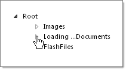

# Properties

## 

* **LoadingMessage** is a string that displays next to the node being expanded. The node needs to have expand mode equal to **ServerSideCallBack** or **WebService**.

* The position of the loading message relative to the node text is determined by the **LoadingStatusPosition** property. Its possible values are as follows:

* **BeforeNodeText**

* **AfterNodeText**

* **BelowNodeText**

* **None** to suppress the loading message.

>caption 

* When the **PersistLoadOnDemandNodes**property is **True** (the default), nodes populated through load-on-demand are persisted on the server automatically.

