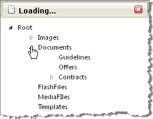

# Server-side Binding


## 

To load data on-demand using server side code:

* Query the root node data, i.e. for the nodes that the user will see first. When using self-referential hierarchical databases this can be done by querying for nodes where the "parent id" is null.

* Iterate the root node data and add new node objects for each record. Assign to the __Text__ property the data column representing readable text and assign the column containing unique identifiers to the __Value__ property of each node. The __Value__ property will be used later as a parent id when opening a node. Set the Node __ExpandMode__ property to __ServerSide;__ expanding a node will cause a postback to the server. During the postback, the server __NodeExpand__ event handler will have a chance to fire.

* Create a __NodeExpand__ event handler. This event will pass a reference to the clicked-on node as a parameter. Use the node __Value__ property to query for all child nodes of this parent node.

* Iterate the child nodes, again populating the __Text__ and __Value__ property of each node. Set each child node's __ExpandMode__ property to __ServerSide.__ Set the __ExpandNode__ for the clicked-on, parent node to __ClientSide;__ the child nodes for this parent node have already been loaded with data so there is no need to return to the server. Also, set the __Expanded__ property of the parent node to __True__.

The example below loads data from the Access Database.mdb database. This database can be found in the RadControls installation directory under Live Demos\App_Data. Any data that has ID, Parent ID and text column data would work in this scenario. In this example the LoadRootNodes() method loads only the node called "Root". When the user clicks that node the first time, the __NodeExpand__ event is fired:

* The data for the child nodes of the parent "Root" are retrieved.

* Nodes are created for each record and attached as child nodes to the parent node. The __ExpandMode__ property of each child node is set to __ServerSide__.

* The parent node "Root" __Expanded__ property is set to __True__, opening the node to display the child nodes.

* The parent node "Root" __ExpandMode__ property is set to __ClientSide__ because the child nodes have already been loaded.

The same general pattern for NodeExpand is repeated when the user clicks a node that has not yet been expanded.


>caption 



>tabbedCode

````C#
	using System;
	using System.Data;
	using System.Data.OleDb;
	using Telerik.Web.UI;
	
	namespace RadTreeView_DataBindDataTable
	{    
	    public partial class _Default : System.Web.UI.Page    
	    {        
	        protected void Page_Load(object sender, EventArgs e)        
	        {            
	            if (!IsPostBack)            
	            {                
	                LoadRootNodes(RadTreeView1);            
	            }        
	        }
	        private void LoadRootNodes(RadTreeView treeView)        
	        {            
	            const string sql = "Select Name, ItemID from Items where ParentID IS NULL";            
	            OleDbConnection connection = new OleDbConnection(Properties.Settings.Default.AccessConnection);            
	            OleDbDataAdapter adapter = new OleDbDataAdapter(sql, connection);            
	            DataTable dataTable = new DataTable();            
	            adapter.Fill(dataTable);
	
	            foreach (DataRow row in dataTable.Rows)            
	            {                
	                RadTreeNode node = new RadTreeNode();                
	                node.Text = row["Name"].ToString();               
	                node.Value = row["ItemID"].ToString();                
	                node.ExpandMode = TreeNodeExpandMode.ServerSide;                
	                RadTreeView1.Nodes.Add(node);            
	            }        
	        }
	
	        protected void RadTreeView1_NodeExpand(object sender, RadTreeNodeEventArgs e)        
	        {            
	            const string sql =@"SELECT Items.ItemID AS NodeId, Items.Name AS NodeText, COUNT(Children.ItemID) AS ChildCount FROM Items LEFT JOIN Items As Children ON Items.ItemID = Children.ParentId WHERE Items.ParentId = @parentId GROUP BY Items.ItemID, Items.Name";
	            OleDbConnection connection = new OleDbConnection(Properties.Settings.Default.AccessConnection);           
	            OleDbDataAdapter adapter = new OleDbDataAdapter(sql, connection);            
	            adapter.SelectCommand.Parameters.AddWithValue("parentId", e.Node.Value);     
	            DataTable dataTable = new DataTable();            
	            adapter.Fill(dataTable);
	
	            foreach (DataRow row in dataTable.Rows)
	            {                
	                RadTreeNode node = new RadTreeNode();
	                node.Text = row["NodeText"].ToString();
	                node.Value = row["NodeId"].ToString();
	                if (Convert.ToInt32(row["ChildCount"]) > 0)        
	                {
	                    node.ExpandMode = TreeNodeExpandMode.ServerSide;
	                }                
	                e.Node.Nodes.Add(node);
	            }
	
	            e.Node.Expanded = true;
	            e.Node.ExpandMode = TreeNodeExpandMode.ClientSide;
	        } 
	    }
	}
				
````


````VB.NET
	Imports System
	Imports System.Data
	Imports System.Data.OleDb
	Imports Telerik.Web.UI
	namespace RadTreeView_DataBindDataTable
	        Partial Public Class _Default
	            Inherits System.Web.UI.Page
	            Protected Sub Page_Load(ByVal sender As Object, ByVal e As EventArgs)
	                If Not IsPostBack Then
	                    LoadRootNodes(RadTreeView1)
	                End If
	            End Sub
	            Private Sub LoadRootNodes(ByVal treeView As RadTreeView)
	                Const sql As String = "Select Name, ItemID from Items where ParentID IS NULL"
	                Dim connection As New OleDbConnection(Properties.Settings.[Default].AccessConnection)
	                Dim adapter As New OleDbDataAdapter(sql, connection)
	                Dim dataTable As New DataTable()
	                adapter.Fill(dataTable)
	                For Each row As DataRow In dataTable.Rows
	                    Dim node As New RadTreeNode()
	                    node.Text = row("Name").ToString()
	                    node.Value = row("ItemID").ToString()
	                    node.ExpandMode = TreeNodeExpandMode.ServerSide
	                    RadTreeView1.Nodes.Add(node)
	                Next
	            End Sub
	            Protected Sub RadTreeView1_NodeExpand(ByVal sender As Object, ByVal e As RadTreeNodeEventArgs)
	                Const sql As String = "SELECT Items.ItemID AS NodeId, Items.Name AS NodeText, COUNT(Children.ItemID) AS ChildCount FROM Items LEFT JOIN Items As Children ON Items.ItemID = Children.ParentId WHERE Items.ParentId = @parentId GROUP BY Items.ItemID, Items.Name"
	                Dim connection As New OleDbConnection(Properties.Settings.[Default].AccessConnection)
	                Dim adapter As New OleDbDataAdapter(sql, connection)
	                adapter.SelectCommand.Parameters.AddWithValue("parentId", e.Node.Value)
	                Dim dataTable As New DataTable()
	                adapter.Fill(dataTable)
	                For Each row As DataRow In dataTable.Rows
	                    Dim node As New RadTreeNode()
	                    node.Text = row("NodeText").ToString()
	                    node.Value = row("NodeId").ToString()
	                    If Convert.ToInt32(row("ChildCount")) > 0 Then
	                        node.ExpandMode = TreeNodeExpandMode.ServerSide
	                    End If
	                    e.Node.Nodes.Add(node)
	                Next
	                e.Node.Expanded = True
	                e.Node.ExpandMode = TreeNodeExpandMode.ClientSide
	            End Sub
	        End Class
	    End Namespace
	
	
````


>end
