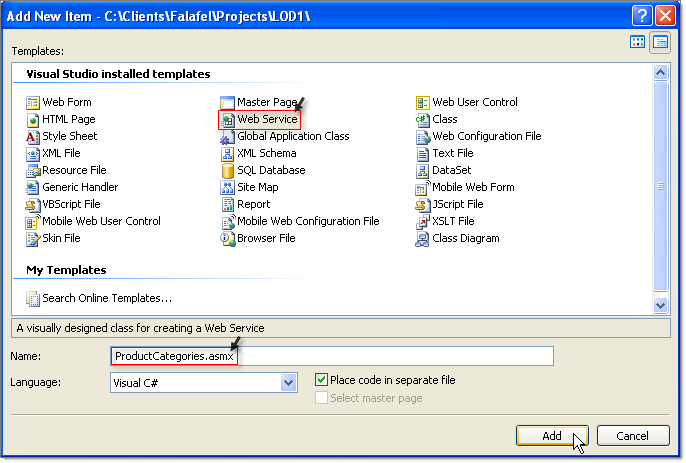

# Tutorial on Web Service Binding


## 

The following tutorial demonstrates how to create a web service that can be consumed by the RadTreeView load-on-demand feature.


>caption 


1. Create an AJAX-Enabled Web Site by selecting the Visual Studio menu __File | New | Web Site.__

1. Select the __ASP.NET AJAX-Enabled Web Site__ option, set the __Location__ to __File System__ and enter a path for the web site. Click OK to close the New Web Site dialog.
>caption 


1. Drop a RadTreeView control from the Toolbox to the default page.

````ASPNET
	    <telerik:RadTreeView ID="RadTreeView1" runat="server" Width="300px">
	        <WebServiceSettings Path="ProductCategories.asmx" Method="GetTreeViewCategories" />
	        <Nodes>
	            <telerik:RadTreeNode Text="Products" Value="1" ExpandMode="WebService">
	            </telerik:RadTreeNode>
	            <telerik:RadTreeNode Text="Purchase" Value="132" ExpandMode="WebService">
	            </telerik:RadTreeNode>
	            <telerik:RadTreeNode Text="Support" Value="141" ExpandMode="WebService">
	            </telerik:RadTreeNode>
	            <telerik:RadTreeNode Text="Community" Value="155" ExpandMode="WebService">
	            </telerik:RadTreeNode>
	            <telerik:RadTreeNode Text="Corporate" Value="164" ExpandMode="WebService">
	            </telerik:RadTreeNode>
	        </Nodes>
	    </telerik:RadTreeView>
````


1. In the Solution Explorer, right click the project and select __Add ASP.NET Folder | App_Code__ from the context menu.

1. In the Solution Explorer, right click the project and select __Add New Item__ from the context menu. From the __Add New Item__ dialog Select __Web Service,__ name the service "ProductCategories.asmx" and click __Add__ to close the dialog.
>caption 



1. In the solution explorer, locate ProductCategories.cs in the App_Code folder. Replace the code with the code below.

>note You can access the __Text__ and __Value__ of the node, which is being expanded, from the RadTreeNodeData parameter passed to the web method.
>public RadTreeNodeData[]
>GetTreeViewCategories( __RadTreeNodeData node__ , object context)
>{
> __node.Text__ //returns the node's text
> ____  __node.Value__ //returns node's value
>}
>


>tabbedCode

````C#
	
	
	    public RadTreeNodeData[] GetTreeViewCategories(RadTreeNodeData node, object context)
	    {
	        DataTable productCategories = GetProductCategories(node.Value);
	        List<RadTreeNodeData> result = new List<RadTreeNodeData>();
	        foreach (DataRow row in productCategories.Rows)
	        {
	            RadTreeNodeData itemData = new RadTreeNodeData(); 
	            itemData.Text = row["Title"].ToString(); 
	            itemData.Value = row["CategoryId"].ToString();
	            if (Convert.ToInt32(row["ChildrenCount"]) > 0) 
	            { 
	                itemData.ExpandMode = TreeNodeExpandMode.WebService; 
	            }
	            result.Add(itemData);
	        }
	        return result.ToArray();
	    }
	
````


````VB.NET
	
	
	    Public Function GetTreeViewCategories(ByVal node As RadTreeNodeData, ByVal context As Object) As RadTreeNodeData()
	        Dim productCategories As DataTable = GetProductCategories(node.Value)
	        Dim result As New List(Of RadTreeNodeData)()
	        For Each row As DataRow In productCategories.Rows
	            Dim itemData As New RadTreeNodeData()
	            itemData.Text = row("Title").ToString()
	            itemData.Value = row("CategoryId").ToString()
	            If Convert.ToInt32(row("ChildrenCount")) > 0 Then
	                itemData.ExpandMode = TreeNodeExpandMode.WebService
	            End If
	            result.Add(itemData)
	        Next
	        Return result.ToArray()
	    End Function
	
````


>end

1. In the Solution Explorer, right click the default page and select __Set as Start Page__ from the context menu.

1. Press F5 to run the web site. Click OK to enable debugging.
