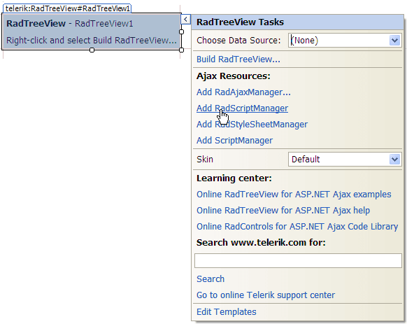
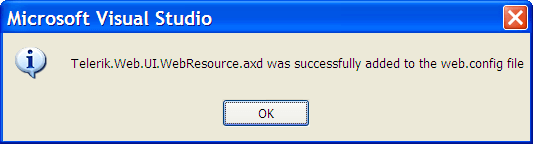
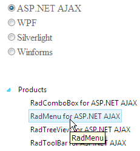

# WCF Service Binding


## 

As of **Q1 2009**, **RadTreeView** supports load on demand from **WCF service**.

The steps below show how to load the nodes of **RadTreeView** from WCF service. It shows how to use the **context** object to pass information from the client to the **OperationContract**. We will set additional **Attributes** for every node (in addition to the **Text** and **Value** properties) so we can see how to use them in the [OnClientNodeDataBound]() event.

1. Create a new Web Site in Visual Studio. Make sure the target framework is set to 3.5

2. Drag **RadTreeView** from your toolbox. From the SmartTag click on the Add **RadScriptManager** link. It will automatically register the handler in the **web.config** file



3. Add the WCF service – right click on your project in Solution Explorer and select Add New Item. This is **important**: select the **Ajax-enabled WCF service** option (do not mix it with WCF Service):

 

  Clicking the Add button will create the .svc file as well as the code behind file placed in the App_Code folder. The web.config file is also automatically updated with the appropriate system.serviceModel node:

  ````XML
  <system.servicemodel>
  <behaviors>
    <endpointBehaviors>
      <behavior name="ServiceAspNetAjaxBehavior">
        <enableWebScript />
      </behavior>
    </endpointBehaviors>
  </behaviors>
  <serviceHostingEnvironment aspNetCompatibilityEnabled="true" />
  <services>
    <service name="Service">
      <endpoint address="" behaviorConfiguration="ServiceAspNetAjaxBehavior" binding="webHttpBinding" contract="Service" />
    </service>
  </services>
  </system.servicemodel>
  ````

>caution These settings are **important** . If you don't have them correct - you might receive a JavaScript error: **Method "MethodName" Failed.** 


4. Open the Service.cs file and add the method which will return the TreeView nodes.

  ````C#
  [ServiceContract(Namespace = "")]
  [AspNetCompatibilityRequirements(RequirementsMode = AspNetCompatibilityRequirementsMode.Allowed)]
  public class Service
  {    
      [OperationContract]    
      public RadTreeNodeData[] GetData(RadTreeNodeData node, IDictionary<string, object> context)    
      {        
          List<RadTreeNodeData> nodes = new List<RadTreeNodeData>();
          string productsSuite = context["ProductSuite"].ToString();
          List<String> radControls = new List<string>() 
          {                                       
              "RadComboBox",
              "RadMenu",
              "RadTreeView",
              "RadToolBar"
          };
          foreach (string radControl in radControls)        
          {
              RadTreeNodeData node = new RadTreeNodeData() 
              {                
                  Text = string.Format("{0} for {1}", radControl, productsSuite),               
                  Value = radControl,
                  //set the attribute of the item which will be used in the ClientDataBound event           
                  Attributes = new Dictionary<string, object> { { "ToolTip", radControl } }            
              };            
              nodes.Add(node);
          }
          return nodes.ToArray();    
      }
  }
  ````


Note that the above code uses the context object which passes the information of the selected **RadioButton** on the page and is set in the [OnClientNodePopulating]() event.

You can set additional attributes to every node by using the Attributes collection. Later, you can read these attributes in [OnClientNodeDataBound]() or [OnClientNodePopulated]() event.

````JavaScript
function OnClientNodePopulatingHandler(sender, e) {
    var context = e.get_context();
    //using jQuery to get the checked item and pass it to the server       
    context["ProductSuite"] = $telerik.$("input[name='rblSuites']:checked").val();
}

function OnClientNodeDataBoundHandler(sender, e) {
    var node = e.get_node();
    //set the ToolTip based on the attribute
    node.set_toolTip(node.get_attributes().getAttribute("ToolTip"));
}
````

Here is the TreeView declaration:

````ASPNET
<asp:RadioButtonList ID="rblSuites" runat="server">
    <asp:ListItem Selected="True">ASP.NET AJAX</asp:ListItem>
    <asp:ListItem>WPF</asp:ListItem>
    <asp:ListItem>Silverlight</asp:ListItem>
    <asp:ListItem>Winforms</asp:ListItem>
</asp:RadioButtonList>
<telerik:RadTreeView RenderMode="Lightweight" runat="server" ID="RadTreeView1" OnClientNodePopulating="OnClientNodePopulatingHandler"
    OnClientNodeDataBound="OnClientNodeDataBoundHandler">
    <Nodes>
        <telerik:RadTreeNode Text="Products" ExpandMode="WebService">
        </telerik:RadTreeNode>
    </Nodes>
    <WebServiceSettings Path="Service.svc" Method="GetData" />
</telerik:RadTreeView>
````

and the result:




# See Also

 * [Web Service Binding]()

 * [Tutorial on Web Service Binding]()

 * [Setting Additional Properties to the Node in the Web Service]()

 * [Overview]()


