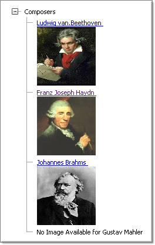
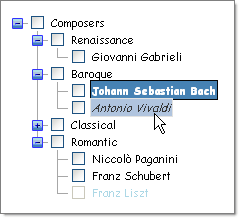
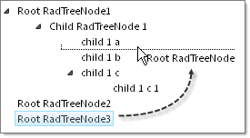
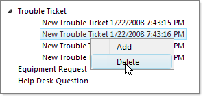

# TreeView Overview

__Telerik RadTreeView for ASP.NET AJAX__ is the supercharged treeview component for ASP.NET, combining highly-efficient rendering and AJAX Load on Demand support for superior performance. Added to this are SEO compliance, full drag-and-drop capabilities, and nearly codeless development experience.

## Key Features

* [Simple rendering]() for minimal HTML output.

* [Template Support]() for complex user interface design not already handled by default RadTreeView behavior.

* [Customizable appearance]() through [skins](A2ACD8E0-A5F3-4093-A5DA-FF45D737F6FA).

* Flexible binding mechanism, including

* [declarative binding]()

* [binding to different types of data source components]()

* [populating from XML]()

* [populating items through a WebService]().

* A rich [client–side API]() that includes the ability to add, delete and update RadTreeView nodes and allow the changes to persist server-side.

* AJAX based [Load-on-demand]() support for faster performance when the RadTreeView has many items.

* [Enhanced Drag & Drop Behavior]() allows dragging onto other nodes, between other nodes, to other trees and onto any HTML element.

* [XHTML and Accessibility standards compliancy](11CA1B9F-1291-479A-9D49-ECDB63F4D912)

* Search Engine Friendly

* Extensive design-time support

* [Built-in Context Menus]()

* [Expand Animation]()

* [Custom Attributes]()

* [Support for Right-to-left locales]()

* [Multiple node selection]()
>caption 

* [Check box support]()

* [Cross-page postbacks]() which let you direct postbacks from the node of a RadTreeView to a different Web page.

* [Keyboard support]() for easy navigation.

* Support for all major browsers, including Internet Explorer 5.0 and above, Netscape 6.0 and above (PC and Mac), Mozilla 0.6 and above (PC and Mac),Firefox 0.9 and above (PC and Mac), Opera 7 and above, and Safari 1.2 and above.

* [Server-side events]() for customizing behavior.
