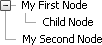

# Creating Node Structure In-Line

You can define the **RadTreeView** structure inline, directly in the ASPX/ASCX file. To do this, enclose every **RadTreeNode** definition within the `<telerik:RadTreeView>` and `</telerik:RadTreeView>` tags. The example below has two root level nodes and a child node under the first root node. Notice in the markup for the **RadTreeView** that a `<Nodes>` tag surrounds one or more node definitions contained in `<telerik:RadTreeNode>` tags.




````ASPNET
<telerik:RadTreeView RenderMode="Lightweight" ID="RadTreeView1" runat="server">
    <Nodes>
        <telerik:RadTreeNode runat="server" Text="My First Node">
            <Nodes>
                <telerik:RadTreeNode runat="server" Text="Child Node">
                </telerik:RadTreeNode>
            </Nodes>
        </telerik:RadTreeNode>
        <telerik:RadTreeNode runat="server" Text="My Second Node">
        </telerik:RadTreeNode>
    </Nodes>
</telerik:RadTreeView>
````


>tip You can also use the[RadTreeView Item Builder]() to interactively construct the **RadTreeNode** hierarchy.
>


