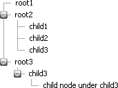
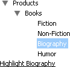
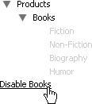

# Working with Nodes on the Server


Using the server-side API, you can programmatically add, remove, disable, or select **RadTreeView** nodes.

## Adding Nodes

To add a node programmatically, create an instance of **RadTreeNode**, assign **Text**, **Value** and other properties, then add the object to a Nodes collection. You can add it to the RadTreeView Nodes collection or the Nodes collection of another Node.


````C#
RadTreeNode newNode = new RadTreeNode();
newNode.Text = "New Node";
newNode.Value = "1234";
RadTreeView1.Nodes.Add(newNode);
````
````VB.NET
Dim newNode As New RadTreeNode()
newNode.Text = "New Node"
newNode.Value = "1234"
RadTreeView1.Nodes.Add(newNode)
````


By adding nodes to the RadTreeView Nodes collection or to the Nodes collection of another node you can define the entire tree structure. The example below demonstrates adding a node with no children, adding a node with three children and adding a node with two levels of children.


>caption 



>note 
* All **RadTreeNodes** have a property called **ParentNode** containing an instance to the parent **RadTreeNode** (if any) or **null** if the parent is the **RadTreeView** itself(i.e. this node is a root).
* All **RadTreeNodes** have an attribute called **TreeView** containing an instance to the parent **RadTreeView** .>


````C#
using Telerik.Web.UI;
namespace RadTreeView
{    
    public partial class _Default : System.Web.UI.Page    
    {        
        protected void Page_Load(object sender, EventArgs e)        
        {            
            if (!Page.IsPostBack)            
            {                
                RadTreeNode root1 = new RadTreeNode("root1");                
                RadTreeView1.Nodes.Add(root1);
                RadTreeNode root2 = new RadTreeNode("root2");
                root2.Nodes.Add(new RadTreeNode("child1"));
                root2.Nodes.Add(new RadTreeNode("child2"));
                root2.Nodes.Add(new RadTreeNode("child3"));
                RadTreeView1.Nodes.Add(root2);
                RadTreeNode root3 = new RadTreeNode("root3");
                RadTreeNode child3 = new RadTreeNode("child3");  
                child3.Nodes.Add(new RadTreeNode("child node under child3"));  
                root3.Nodes.Add(child3);                
                RadTreeView1.Nodes.Add(root3);    
            }     
        } 
    }
}
````
````VB.NET
Imports Telerik.Web.UI
Namespace RadTreeView
    Partial Public Class _Default
        Inherits System.Web.UI.Page
        Protected Sub Page_Load(ByVal sender As Object, ByVal e As EventArgs)
            If Not Page.IsPostBack Then
                Dim root1 As New RadTreeNode("root1")
                RadTreeView1.Nodes.Add(root1)
                Dim root2 As New RadTreeNode("root2")
                root2.Nodes.Add(New RadTreeNode("child1"))
                root2.Nodes.Add(New RadTreeNode("child2"))
                root2.Nodes.Add(New RadTreeNode("child3"))
                RadTreeView1.Nodes.Add(root2)
                Dim root3 As New RadTreeNode("root3")
                Dim child3 As New RadTreeNode("child3")
                child3.Nodes.Add(New RadTreeNode("child node under child3"))
                root3.Nodes.Add(child3)
                RadTreeView1.Nodes.Add(root3)
            End If
        End Sub
    End Class
End Namespace
````


You can add multiple nodes at once by using the **AddRange** method of the **RadTreeNodeCollection**. The following code creates a new root node and adds all current nodes as a child of that node:


````C#
RadTreeNode node = new RadTreeNode("New ROOT");
node.Nodes.AddRange(RadTreeView1.Nodes.Cast<RadTreeNode>());
RadTreeView1.Nodes.Add(node);
````
````VB.NET
Dim node As New RadTreeNode("New ROOT")
node.Nodes.AddRange(RadTreeView1.Nodes.Cast(Of RadTreeNode)())
RadTreeView1.Nodes.Add(node)
````


## Removing Nodes

You can remove nodes by:

* Calling the node's **Remove()** method.

* Calling the Nodes collection **Remove()** method and passing a reference to the node.

* Calling the Nodes collection **RemoveAt()** method and passing the index of the node to be removed. Be careful with this last method as the indexing is relative to each Nodes collection. Notice in the code example how the **RemoveAt()** method is called not from the **RadTreeView** nodes collection, but through the parent of the node being removed.

* Calling **Nodes.Clear()** to remove all nodes at one time.


````C#
protected void btnDelete_Click(object sender, EventArgs e)
{    
    if (RadTreeView1.SelectedNode != null)    
    {        
        RadTreeView1.SelectedNode.Remove();
        // or ...
        //RadTreeView1.Nodes.Remove(RadTreeView1.SelectedNode);
        // or ...               

        //RadTreeView1.SelectedNode.ParentNode.Nodes.RemoveAt(RadTreeView1.SelectedNode.Index);            
    }
}
````
````VB.NET
Protected Sub btnDelete_Click(ByVal sender As Object, ByVal e As EventArgs)
    If RadTreeView1.SelectedNode IsNot Nothing Then
        RadTreeView1.SelectedNode.Remove()
        ' or ...
        'RadTreeView1.Nodes.Remove(RadTreeView1.SelectedNode)
        ' or ...
        'RadTreeView1.SelectedNode.ParentNode.Nodes.RemoveAt(RadTreeView1.SelectedNode.Index)
    End If
End Sub
````


## Selecting Nodes

Setting the **RadTreeNode** **Selected** property typically highlights the node, depending on the styling of the **RadTreeView** [Skin](). The typical scenario for selecting a node programmatically is first locating the node, then setting its **Selected** property. The example below uses a **LinkButton** to trigger finding a node with "Biography" in the text, then selects the node.




````C#
protected void LinkButton1_Click(object sender, EventArgs e)
{    
    RadTreeNode node = RadTreeView2.FindNodeByText("Biography");    
    if (node != null)    
    {       
        node.Selected = true;    
    }
}
````
````VB.NET
Protected Sub LinkButton1_Click(ByVal sender As Object, ByVal e As EventArgs)
    Dim node As RadTreeNode = RadTreeView2.FindNodeByText("Biography")
    If node IsNot Nothing Then
        node.Selected = True
    End If
End Sub	
````


## Disabling/Enabling Nodes

Setting the **RadTreeNode** **Enabled** property to false makes the node inactive and un-clickable. The appearance of the node is typically in a grey or other faint color, depending on the styling of the **RadTreeView** [Skin](). The example below locates the "Books" node and disables all its child nodes.


>caption 




````C#
protected void LinkButton1_Click(object sender, EventArgs e)
{    
    RadTreeNode node = RadTreeView2.FindNodeByText("Books");    
    foreach (RadTreeNode childNode in node.Nodes)    
    {        
        childNode.Enabled = false;    
    }
}
````
````VB.NET
Protected Sub LinkButton1_Click(ByVal sender As Object, ByVal e As EventArgs)
    Dim node As RadTreeNode = RadTreeView2.FindNodeByText("Books")
    For Each childNode As RadTreeNode In node.Nodes
        childNode.Enabled = False
    Next
End Sub
````


