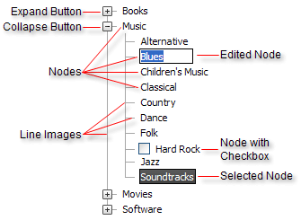

# RadTreeView Structure

## 

The structure of a RadTreeView is as follows:

The tree consists of a hierarchical structure of nodes linked together with line images. Each node may display Expand or Collapse buttons if the node contains child nodes. Depending on the property settings of the RadTreeView and the node, nodes may be edited, selected or have checkboxes.
