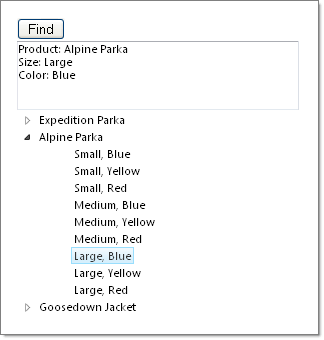

# Tutorial on Finding Nodes


## 

The following tutorial demonstrates how to find a Node using methods of **RadTreeView** and **RadTreeView.Nodes** objects. The example first locates a root level Node by text, then searches its child Nodes for a specific attribute.




1. In a new AJAX-Enabled Web Application, drop a standard ASP.NET Button, a RadTextBox and a RadTreeView to the default form.

1. In the Properties Window set the Skin property of the RadTreeView to Vista.

1. In the Properties Window set the ID property of the button to "btnFind".

1. In the Properties Window set the ID property of the RadTextBox to "tbResults" and the Skin property to Vista.

1. Double-click the button to create a Click event handler.

1. In the code view for the form, add Telerik.Web.UI to the "uses" (C#) or "Imports" (VB) section.
    ````C#
using Telerik.Web.UI;	
````
    ````VB.NET
Imports Telerik.Web.UI	
````

1. Add an array and two enumerations to the page class. These will be used to populate our RadTreeView.
    ````C#
private string[] Products = new string[] { "Expedition Parka", "Alpine Parka", "Goosedown Jacket" };
enum Sizes { Small, Medium, Large };
enum Colors { Blue, Yellow, Red };
````
    ````VB.NET
Private Products As String() = New String() {"Expedition Parka", "Alpine Parka", "Goosedown Jacket"}
Enum Sizes
    Small
    Medium
    Large
End Enum
Enum Colors
    Blue
    Yellow
    Red
End Enum
````

1. Populate the **Page_Load** event handler with the code shown below. *This code has nested iterations of the Products string array, the Sizes enumeration and the Colors enumeration. For every new product name a root level Node is created. For every size and color for that product a child Node is created. Custom attributes "Size" and "Color" are attached to the child Node.*
    ````C#
protected void Page_Load(object sender, EventArgs e)
{
   if (!Page.IsPostBack)
   {
       foreach (string product in Products)
       {
           RadTreeNode productNode = new RadTreeNode(product);
           foreach (Sizes size in Enum.GetValues(typeof(Sizes)))
           {
               foreach (Colors color in Enum.GetValues(typeof(Colors)))
               {
                   RadTreeNode modelNode = new RadTreeNode(size.ToString() + ", " + color.ToString());
                   modelNode.Attributes.Add("Size", size.ToString());
                   modelNode.Attributes.Add("Color", color.ToString());
                   productNode.Nodes.Add(modelNode);
               }
           }
           RadTreeView1.Nodes.Add(productNode);
       }
   }
}
````
    ````VB.NET
Protected Sub Page_Load(ByVal sender As Object, ByVal e As EventArgs)
    If Not Page.IsPostBack Then
        For Each product As String In Products
            Dim productNode As New RadTreeNode(product)
            For Each size As Sizes In [Enum].GetValues(GetType(Sizes))
                For Each color As Colors In [Enum].GetValues(GetType(Colors))
                    Dim modelNode As New RadTreeNode(size.ToString() + ", " + color.ToString())
                    modelNode.Attributes.Add("Size", size.ToString())
                    modelNode.Attributes.Add("Color", color.ToString())
                    productNode.Nodes.Add(modelNode)
                Next
            Next
            RadTreeView1.Nodes.Add(productNode)
        Next
    End If
End Sub
````


1. Add the code below to the button's **Click** event handler. *The first Node search is against all the Nodes in the tree for the text "Alpine Parka". If the Node is found, a second search is done against the Nodes collection of the "Alpine Parka" Node. This second search is looking for a Node with an attribute called "Size" where the value for the Size attribute is "Large". If this child Node is found then the product name is added to the RadTextBox, the product Node is expanded to display the child Nodes and the specific Node we are looking for is selected. The attributes for the Node are iterated and the contents are appended to the RadTextBox.*
    ````C#
protected void btnFind_Click(object sender, EventArgs e)
{
   RadTreeNode productNode = RadTreeView1.FindNodeByText("Alpine Parka");
   if (productNode != null)
   {
       RadTreeNode modelNode = productNode.Nodes.FindNodeByAttribute("Size", Sizes.Large.ToString());
       if (modelNode != null)
       {
           tbResults.Text = "Product: " + productNode.Text + System.Environment.NewLine;
           productNode.Expanded = true;
           modelNode.Selected = true;
           foreach (string key in modelNode.Attributes.Keys)
           {
               tbResults.Text += key + ": " + modelNode.Attributes[key] + System.Environment.NewLine;
           }
       }
   }
}
````
    ````VB.NET
Protected Sub btnFind_Click(ByVal sender As Object, ByVal e As EventArgs)
    Dim productNode As RadTreeNode = RadTreeView1.FindNodeByText("Alpine Parka")
    If productNode <> Nothing Then
        Dim modelNode As RadTreeNode = productNode.Nodes.FindNodeByAttribute("Size", Sizes.Large.ToString())
        If modelNode IsNot Nothing Then
            tbResults.Text = "Product: " + productNode.Text + System.Environment.NewLine
            productNode.Expanded = True
            modelNode.Selected = True
            For Each key As String In modelNode.Attributes.Keys
                tbResults.Text += key + ": " + modelNode.Attributes(key) + System.Environment.NewLine
            Next
        End If
    End If
End Sub
````


1. Press F5 to run the application.


