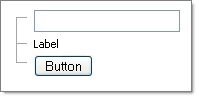

# Using the Node Controls Collection


## 

You can add controls directly to the **Controls** collection of a **RadTreeNode**. The example below shows three Nodes being created and a **TextBox**, **Label** and **Button** controls being added to each **Controls** collection.





````C#
RadTreeNode root1 = new RadTreeNode("root1");
TextBox textbox1 = new TextBox();
root1.Controls.Add(textbox1);
RadTreeView2.Nodes.Add(root1);
RadTreeNode root2 = new RadTreeNode("root2");
Label label1 = new Label();
label1.Text = "Label";
root2.Controls.Add(label1);
RadTreeView2.Nodes.Add(root2);
RadTreeNode root3 = new RadTreeNode("root3");
Button button = new Button();
button.Text = "Button";
root3.Controls.Add(button);
RadTreeView2.Nodes.Add(root3);		
````
````VB.NET
Dim root1 As New RadTreeNode("root1")
Dim textbox1 As New TextBox()
root1.Controls.Add(textbox1)
RadTreeView2.Nodes.Add(root1)
Dim root2 As New RadTreeNode("root2")
Dim label1 As New Label()
label1.Text = "Label"
root2.Controls.Add(label1)
RadTreeView2.Nodes.Add(root2)
Dim root3 As New RadTreeNode("root3")
Dim button As New Button()
button.Text = "Button"
root3.Controls.Add(button)
RadTreeView2.Nodes.Add(root3) 
````

