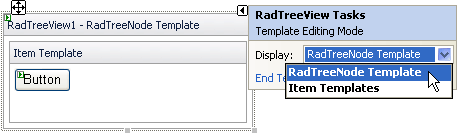
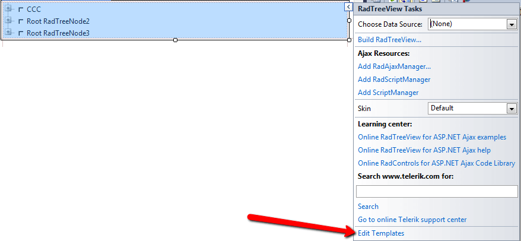
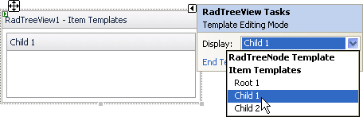
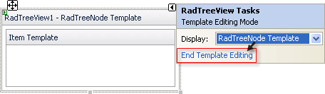

# Adding and Editing Templates at Design Time

## How to add and edit Templates

To add and edit a **global (RadTreeView Node Template)** Template:

1. Access the **RadTreeView Node Template** editor:

1. Open the RadTreeView Smart Tag, click**Edit Templates** and choose **RadTreeViewNode Template**
>caption 

ORRight-click the instance of RadTreeView, and select **Edit Templates** | **RadTreeViewNode Template** from the Context Menu.
>caption 

1. Add any content to the **RadTreeView Node Template** editor. For example, to add a third-party control, drag the control from the Toolbox.To add and edit a **Per-Node (Node Template)** TreeView Template:

1. Access the **Node Templates** editor:

1. On the TreeView Smart Tag, click **Edit Templates**and choose an Item
>caption 

ORRight-click the instance of Telerik RadTreeView, and select **Edit Template** --> **Node Templates**.
>caption 

1. Add any content to the Template using the **Node Templates** editor. For example, to add a third-party control, drag the desired control from the Toolbox.When you are done, press the **End Template Editing**option from the Smart Tag:
>caption 

# See Also

 * [Template Design Surface]()
