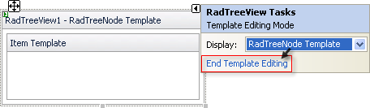

# Adding and Editing Templates at Design Time

## How to add and edit Templates

To add and edit a __global (RadTreeView Node Template)__ Template:

1. Access the __RadTreeView Node Template__ editor:

1. Open the RadTreeView Smart Tag, click__Edit Templates__ and choose __RadTreeViewNode Template__
>caption 

ORRight-click the instance of RadTreeView, and select __Edit Templates__ | __RadTreeViewNode Template__ from the Context Menu.
>caption 

1. Add any content to the __RadTreeView Node Template__ editor. For example, to add a third-party control, drag the control from the Toolbox.To add and edit a __Per-Node (Node Template)__ TreeView Template:

1. Access the __Node Templates__ editor:

1. On the TreeView Smart Tag, click __Edit Templates__and choose an Item
>caption 

ORRight-click the instance of Telerik RadTreeView, and select __Edit Template__ --> __Node Templates__.
>caption 

1. Add any content to the Template using the __Node Templates__ editor. For example, to add a third-party control, drag the desired control from the Toolbox.When you are done, press the __End Template Editing__option from the Smart Tag:
>caption 

# See Also

 * [Template Design Surface]()
