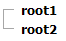

# Adding and Editing Templates at Runtime


## 

You can also add Templates to __RadTreeView__ at runtime, using the __NodeTemplate__ property. This property is of type __ITemplate__, so you must assign an object that implements that interface as a value:

>note The TreeNodes should be dynamically added so that Templates can be defined at run time.
>Also, the __Nodes should be bound__ to be able to eval DataBinder expressions. In other words, you should call the __DataBind__ method of the RadTreeView object or bind the Nodes that are about to use __DataBinder.Eval__ . You can bind a specific node by calling the __DataBind__ method of this specific Node.
>


>caution The NodeTemplate should be initialized in the OnInit event of the page. This is needed as the Template should be instantiated before the TreeNodes are initialized.
>


>tabbedCode

````C#
	
	
	    protected override void OnInit(EventArgs e)
	    {
	        RadTreeView1.NodeTemplate = new TextBoxTemplate();
	        base.OnInit(e);
	    }
	
	    protected void Page_Load(object sender, EventArgs e)
	    {
	        if (!Page.IsPostBack)
	        {
	            RadTreeView1.Nodes.Add(new RadTreeNode("root1")); RadTreeView1.Nodes.Add(new RadTreeNode("root2"));
	        }
	
	        RadTreeView1.DataBind();
	    }
	    class TextBoxTemplate : ITemplate
	    {
	        public void InstantiateIn(Control container)
	        {
	            Label label1 = new Label();
	            label1.ID = "ItemLabel";
	            label1.Text = "Text";
	            label1.Font.Size = 10;
	            label1.Font.Bold = true;
	            label1.DataBinding += new EventHandler(label1_DataBinding);
	            container.Controls.Add(label1);
	        }
	
	        private void label1_DataBinding(object sender, EventArgs e)
	        {
	            Label target = (Label)sender;
	            RadTreeNode node = (RadTreeNode)target.BindingContainer;
	            string nodeText = (string)DataBinder.Eval(node, "Text");
	            target.Text = nodeText;
	        }
	    }
	
````
````VB.NET
	
	    Protected Overloads Overrides Sub OnInit(ByVal e As EventArgs)
	        RadTreeView1.NodeTemplate = New TextBoxTemplate()
	        MyBase.OnInit(e)
	    End Sub
	
	    Protected Sub Page_Load(ByVal sender As Object, ByVal e As EventArgs)
	        If Not Page.IsPostBack Then
	            RadTreeView1.Nodes.Add(New RadTreeNode("root1"))
	            RadTreeView1.Nodes.Add(New RadTreeNode("root2"))
	        End If
	        RadTreeView1.DataBind()
	    End Sub
	
	    'Class TextBoxTemplate
	    Implements ITemplate
	        Public Sub InstantiateIn(ByVal container As Control) Implements InstantiateIn
	        Dim label1 As New Label()
	        label1.ID = "ItemLabel"
	        label1.Text = "Text"
	        label1.Font.Size = 10
	        label1.Font.Bold = True
	        AddHandler label1.DataBinding, AddressOf label1_DataBinding
	        container.Controls.Add(label1)
	    End Sub
	    Private Sub label1_DataBinding(ByVal sender As Object, ByVal e As EventArgs)
	        Dim target As Label = DirectCast(sender, Label)
	        Dim node As RadTreeNode = DirectCast(target.BindingContainer, RadTreeNode)
	        Dim nodeText As String = DirectCast(DataBinder.Eval(node, "Text"), String)
	        target.Text = nodeText
	    End Sub
	End Class
	
````
>end

If you want to add different templates to specific nodes, based on some property or value for instance, the best way is to use the __TemplateNeeded__ event.

>tabbedCode

````C#
	    
	    protected void RadTreeView1_TemplateNeeded(object sender, Telerik.Web.UI.RadTreeNodeEventArgs e)
	    {
	        string value = e.Node.Value;
	        if (value != null)
	        {
	            // if the value is an even number
	            if ((Int32.Parse(value) % 2) == 0)
	            {
	                var textBoxTemplate = new TextBoxTemplate();
	                e.Node.NodeTemplate = textBoxTemplate;
	            }
	        }
	    }
	
````
````VB.NET
	
	Sub RadTreeView1_Template(ByVal sender As Object, ByVal e As Telerik.Web.UI.RadTreeNodeEventArgs) Handles RadTreeView1.TemplateNeeded
	    Dim value As String = e.Node.Value
	    If value IsNot Nothing Then
	        ' if the value is an even number
	        If ((Int32.Parse(value) Mod 2) = 0) Then
	            Dim textBoxTemplate As TextBoxTemplate = New TextBoxTemplate()
	            e.Node.NodeTemplate = textBoxTemplate
	        End If
	    End If
	End Sub
	
````
>end

If for some reason you cannot define the Template in the OnInit event of the page, or take advantage of the TemplateNeeded event, you could use another approach:

>note The Template has to be instantiated for each Node upon a postback. Since the __TextBoxTemplate__ class initializes the Label on InstantiateIn we called the InstantiateIn method of the TextBoxTemplate object for each Node.
>


>tabbedCode

````C#
	
	
	    protected void Page_Load(object sender, EventArgs e)
	    {
	        if (!Page.IsPostBack)
	        {
	            RadTreeView1.Nodes.Add(new RadTreeNode("root1"));
	            RadTreeView1.Nodes.Add(new RadTreeNode("root2"));
	        }
	
	        TextBoxTemplate template = new TextBoxTemplate();
	
	        foreach (RadTreeNode node in RadTreeView1.GetAllNodes())
	        {
	            template.InstantiateIn(node);
	        }
	
	        RadTreeView1.DataBind();
	    }
	
````
````VB.NET
	
	
	Protected Sub Page_Load(ByVal sender As Object, ByVal e As EventArgs)
	    If Not Page.IsPostBack Then
	        RadTreeView1.Nodes.Add(New RadTreeNode("root1"))
	        RadTreeView1.Nodes.Add(New RadTreeNode("root2"))
	    End If
	    Dim template As New TextBoxTemplate()
	    For Each node As RadTreeNode In RadTreeView1.GetAllNodes()
	        template.InstantiateIn(node)
	    Next
	    RadTreeView1.DataBind()
	End Sub
	
	
````
>end

The end result of this code looks like the following:


